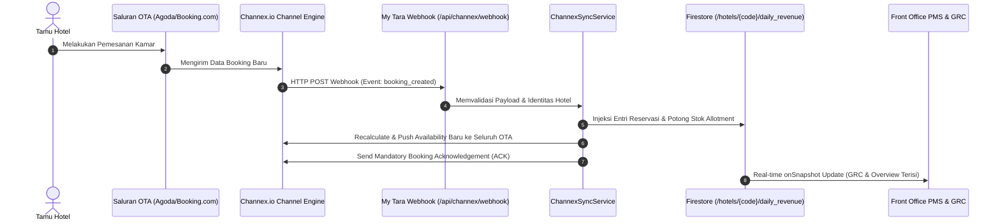
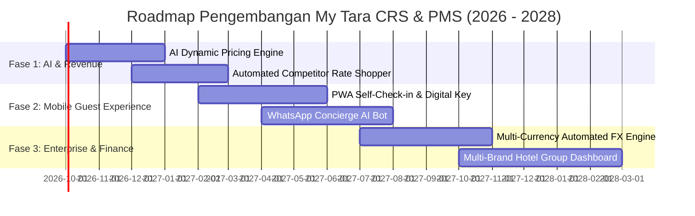

# My Tara CRS & Booking Engine (Setara Hospitality Venture)

> **Platform Reservasi Terpusat Multi-Properti (CRS), Ekosistem PMS Terintegrasi, dan Direct Booking Engine Bertenaga AI untuk Industri Perhotelan Modern.**

---

## 1. Ikhtisar Platform (Platform Overview)

**My Tara CRS** (bagian dari ekosistem *Setara Hospitality Venture*) adalah platform perhotelan terintegrasi skala enterprise yang menggabungkan:
1. **Central Reservation System (CRS) & Direct Booking Engine**: Portal reservasi langsung untuk tamu dengan dynamic domain binding per hotel partner.
2. **2-Way Enterprise Channel Manager**: Mesin integrasi dua arah berstandar sertifikasi Channex.io yang menghubungkan inventori kamar ke 68+ saluran Online Travel Agent (OTA) global (Booking.com, Agoda, Traveloka, Tiket.com, Expedia, Airbnb, Trip.com, Google Hotel Ads, dll.).
3. **Property Management System (PMS) Front Office**: Manajemen reservasi harian (*Daily Revenue*), Guest Reservation Chart (GRC), okupansi real-time, dan peramalan (*Forecast*).
4. **Point of Sale (LexuPOS) & F&B Management**: Modul kasir restoran/kafe dengan cetak struk termal 80mm, *Kitchen Order Ticket* (KOT), dan *Self-Ordering GrabFood-style* untuk tamu meja/kamar.
5. **Purchasing & Inventory Control**: Pengadaan barang (*Daily Market List*, *Store Requisition*, *Purchase Order*), stok opname, dan manajemen supplier.
6. **Financial Statements & Accounting**: Buku Besar (*General Ledger*), Laporan Laba Rugi (*P&L*), Neraca (*Balance Sheet*), Laporan Arus Kas (*Cash Flow* Metode Langsung), dan *Daily Sales Report* (DSR).
7. **Digital Guest Experience**: *Digital Self-Check-in*, cetak syarat & ketentuan menginap, serta portal absensi karyawan mandiri berbasis geolokasi.
8. **Superadmin Multi-Property Registry**: Manajemen multi-tenant terisolasi, penagihan lisensi terpusat (*Central Billing*), dan audit log kepatuhan.

---

## 2. Status Terkini Proyek (Current Project Status)

Platform saat ini berada pada status **Production-Ready (Tahap Live & Sertifikasi Integrasi)** dengan fitur-fitur operasional yang telah aktif secara menyeluruh:

### A. Central Reservation System (CRS) & Booking Engine (`landing-page`)
- [x] **Dynamic Domain Routing**: Resolusi host dinamis di tingkat server (`getServerSideHotel`) dan client (`HotelProvider`). Mengakses domain hotel partner langsung memuat logo, galeri, tipe kamar, dan paket promosi milik hotel tersebut.
- [x] **Dynamic Room Catalog & Availability**: Membaca ketersediaan kamar riil dari koleksi `hotels/{hotelCode}/roomTypes` dan `daily_revenue` tanpa data dummy.
- [x] **Guest Booking Flow**: Alur pemesanan kamar lengkap dengan pemilihan tanggal, penambahan ekstra fasilitas/sarapan, input data tamu, dan verifikasi reservasi.
- [x] **Payment Gateway & Transfer Confirmation**: Dukungan pembayaran via transfer bank dan upload bukti bayar langsung ke Firebase Storage dengan notifikasi otomatis ke Front Office.
- [x] **Suspended Service Guard**: Proteksi penonaktifan otomatis jika status hotel partner tidak aktif (`active: false`) dengan tampilan peringatan penangguhan layanan billing yang rapi.

### B. Enterprise Channel Manager 2-Way CRS (`admin-dashboard`)
- [x] **68+ OTA Channel Catalog**: Katalog saluran global lengkap dengan logo resmi dan skema komisi standar.
- [x] **Real-Time ARI Push Engine**: Sinkronisasi ketersediaan (*Availability*), harga (*Rates*), dan restriksi (*Stop Sell*, *Min/Max Stay*, *Closed to Arrival/Departure*) ke Channex API.
- [x] **Pemetaan ID Extranet (Room & Rate Mapping)**: Form pemetaan interaktif antara ID lokal My Tara dengan Extranet OTA ID, dilengkapi tombol **Test Ping Koneksi** real-time.
- [x] **Matriks Harga Net vs Gross (BAR)**: Kalkulator konversi harga otomatis yang memperhitungkan komisi spesifik per saluran OTA sehingga pendapatan bersih hotel terlindungi.
- [x] **Aturan Alokasi Saluran (Yield Management Rules)**: Pengaturan alokasi kamar otomatis berbasis persentase atau batas kuota untuk memaksimalkan margin keuntungan saat *peak season*.
- [x] **Unified Guest Messaging (2-Way Inbox)**: Integrasi perpesanan dua arah untuk berkomunikasi langsung dengan tamu Airbnb dan Expedia melalui API resmi tanpa membuka ekstranet terpisah.
- [x] **Unified Guest Reviews & Quality Metrics**: Pengumpulan ulasan tamu dari seluruh OTA secara terpusat dengan kalkulasi skor riil (*Cleanliness*, *Staff*, *Location*, *Comfort*, *Value*).
- [x] **PCI-DSS Compliant VCC Viewer**: Dekripsi kartu kredit virtual (Virtual Credit Card) dari Booking.com/Agoda dengan autentikasi Master PIN keamanan serta pencatatan audit log permanen (`vcc_audit_logs`).
- [x] **Distribusi Konten & Fasilitas**: Sinkronisasi foto resolusi tinggi dari Galeri/Kamar dan checklist amenitas hotel langsung ke listing Airbnb dan Google Hotel Ads.
- [x] **Audit Log Diagnostik Tasks**: Perekaman transaksi API riil ke `channex_task_logs` untuk memantau status pengakuan (*OTA ACK*) dan latensi jaringan.
- [x] **Desain Navigasi Dua Tingkat Profesional**: Pengelompokan 14 sub-modul ke dalam 4 pilar fungsional (*Inventori & Tarif*, *Saluran OTA*, *Layanan Tamu*, *Sistem & Integrasi*) dengan tipografi minimalis tanpa *clutter* ikon.
- [x] **Zero Dummy Data Guaranteed**: Seluruh data mock, sampel foto Unsplash, dan kartu dummy telah dibersihkan secara tuntas; sistem beroperasi 100% pada data riil Firestore dan Channex API.

### C. Front Office & Operasional Hotel
- [x] **Front Office Daily Revenue Ledger**: Pencatatan transaksi akomodasi harian, kas masuk (*payHotel*), transfer/OTA (*payTransfer*), dan piutang.
- [x] **Guest Reservation Chart (GRC) & Calendar**: Denah penempatan kamar interaktif dengan visualisasi status check-in, in-house, check-out, dan reservasi OTA.
- [x] **Anti-Overbooking Automation**: Reservasi masuk dari webhook Channex otomatis memotong stok kamar hotel dan memicu kalkulasi ulang ketersediaan ke seluruh OTA lain secara instan.
- [x] **Pemberian Kompensasi (Compliment Tracking)**: Penandaan kamar komplementer (*free/compliment*) yang otomatis membukukan pengakuan beban dan pendapatan kotor seimbang pada akuntansi tanpa menggelembungkan kas.

### D. Keuangan, Akuntansi & Logistik
- [x] **Dynamic POS to P&L Cost & Revenue Routing**: Transaksi F&B dari POS otomatis mengalir ke akun pendapatan dan beban P&L yang sesuai (`FOOD`, `BEVERAGE`, `BANQUET`, atau `OTHER`).
- [x] **Direct Method Cash Flow Statement**: Laporan Arus Kas metode langsung yang terverifikasi dan seimbang secara presisi dengan akun Kas & Bank pada Neraca.
- [x] **Invoice-Based Purchasing Integration**: Pengakuan beban dan hutang dagang (*Accounts Payable*) pada saat faktur barang diterima, disusul pemotongan kas saat pelunasan faktur.

---

## 3. Arsitektur Sistem & Aliran Data (System Architecture)

Sistem My Tara dibangun dengan arsitektur **Monorepo Berbasis Cloud Native** yang menjamin skalabilitas tinggi, pemeliharaan kode yang terpusat, dan isolasi data per hotel partner yang ketat.

### A. Struktur Monorepo (Turborepo + pnpm)
```text
crs-setara/
├── apps/
│   ├── admin-dashboard/       # PMS, CRS, Channel Manager & Accounting Platform
│   ├── landing-page/          # Public Guest Direct Booking Engine & Hotel Showcase
│   └── Point-of-sales-Nextjs/ # Standalone F&B Cashier & Table Management System
├── functions/                 # Cloud Functions (Cron Jobs, Soft-delete cleanup)
├── firestore.rules            # Aturan keamanan database & isolasi tenant
├── pnpm-workspace.yaml        # Konfigurasi monorepo pnpm
└── turbo.json                 # Pipeline build & cache orchestration
```

### B. Strategi Isolasi Basis Data (Dynamic Path Isolation)
Untuk melayani banyak hotel (*multi-tenant*) dalam satu infrastruktur Firebase terpadu tanpa risiko kebocoran data antar-hotel, digunakan skema **Dynamic Path Isolation**:

```text
/hotels (Koleksi Master Registry)
  └── {hotelCode} (Dokumen Profil & Konfigurasi Hotel)
        ├── name, domain, billing, channelManager: { apiKey, propertyId, channels }
        │
        /* Sub-Koleksi Operasional Terisolasi */
        ├── roomTypes/              # Master tipe kamar & harga dasar
        ├── rate_plans/             # Paket harga (BAR, Promo, Non-Refundable)
        ├── daily_revenue/          # Catatan transaksi kamar & reservasi FO
        ├── guest_messages/         # Pesan tamu OTA 2-way
        ├── guest_reviews/          # Ulasan dan rating tamu
        ├── channel_rules/          # Aturan alokasi yield
        ├── channex_task_logs/      # Log diagnostik transmisi ARI
        ├── vcc_audit_logs/         # Audit log akses kartu virtual PCI
        ├── pos_orders/             # Transaksi kasir POS restoran
        ├── gallery/                # Galeri foto hotel
        └── users_master/           # Akun personnel staf & hak akses
```

### C. Diagram Aliran Data Reservasi OTA (Channel Manager Ingestion Flow)



---

## 4. Panduan Menjalankan Proyek (Getting Started)

### Prasyarat
- **Node.js**: Versi `>= 20.x`
- **Package Manager**: `pnpm` (Versi `>= 9.x`)

### Instalasi Dependensi
Jalankan perintah berikut di root repositori:
```bash
pnpm install
```

### Menjalankan Server Pengembangan (Dev Server)
Untuk menjalankan seluruh workspace secara bersamaan:
```bash
pnpm dev
```

Atau menjalankan aplikasi secara spesifik:
```bash
# Menjalankan Landing Page / Booking Engine saja (Port 3000 atau dinamis)
pnpm --filter landing-page dev

# Menjalankan Admin Dashboard & CRS Channel Manager (Port 3000 / 3001)
pnpm --filter admin-dashboard dev
```

> [!CAUTION]
> **Peringatan Penting Operasional**: Jangan menjalankan perintah `pnpm build` atau `npm run build` di lingkungan server aktif saat pengujian, karena hal ini dapat memicu restart server terus-menerus.

---

## 5. Rencana Pengembangan Masa Depan (Strategic Future Roadmap)

Berikut adalah cetak biru pengembangan jangka menengah dan panjang (*Roadmap 2026–2028*) untuk membawa ekosistem My Tara menjadi pemimpin pasar perangkat lunak perhotelan di Asia Tenggara:



### Fase 1: AI Dynamic Pricing & Market Intelligence (Q4 2026 – Q1 2027)
- [ ] **AI-Powered Dynamic Pricing Engine**: Algoritma pembelajaran mesin (*Machine Learning*) yang secara otomatis menaikkan atau menurunkan tarif kamar Best Available Rate (BAR) berdasarkan tren okupansi lokal, prakiraan cuaca, data libur nasional, dan kecepatan pemesanan (*booking velocity*).
- [ ] **Automated OTA Rate Shopper (CompSet Tracker)**: *Web scraper* & *API crawler* legal yang memantau harga kamar 5 hotel kompetitor terdekat secara real-time untuk memberi rekomendasi penyesuaian harga kompetitif.

### Fase 2: Enhanced Guest Mobile Experience & Keyless Entry (Q1 2027 – Q3 2027)
- [ ] **Progressive Web App (PWA) Guest Companion**: Aplikasi web mandiri tanpa unduhan bagi tamu untuk melihat detail reservasi, meminta layanan kamar (*room service*), meminta pembersihan kamar (*housekeeping request*), dan melakukan *express check-out*.
- [ ] **Integrasi Smart Lock & Digital Keyless Access**: Integrasi API dengan sistem kunci pintu pintar hotel (TTLock / Dormakaba) untuk mengirimkan e-kunci atau PIN pintu kamar langsung ke ponsel tamu setelah verifikasi KTP digital selesai.
- [ ] **WhatsApp Business AI Concierge**: Bot interaktif WhatsApp bertenaga LLM yang menjawab pertanyaan umum tamu, mengonfirmasi jam check-in, dan mengirimkan notifikasi nomor kamar serta kwitansi pembayaran secara otomatis.

### Fase 3: International Finance & Multi-Property Franchising (Q3 2027 – Q1 2028)
- [ ] **Multi-Currency Automated FX Reconciliation Engine**: Konversi nilai tukar valuta asing (USD, EUR, SGD, AUD, JPY) secara otomatis dengan integrasi kurs harian Bank Indonesia / Open Exchange Rates untuk memudahkan tamu mancanegara.
- [ ] **Multi-Brand Franchising & Owner Portal**: Dasbor eksekutif khusus pemilik modal / grup hotel waralaba untuk memantau performa keuangan konsolidasian dari puluhan cabang properti dalam satu layar ringkasan.

---

## 6. Lisensi & Hak Cipta

Seluruh hak cipta dan kepemilikan kode sumber dilindungi oleh undang-undang:
**Copyright © 2026 Setara Hospitality Venture / My Tara Technology. All rights reserved.**
Dilarang mendistribusikan, memodifikasi, atau menggunakan basis kode ini untuk kepentingan komersial tanpa izin tertulis dari manajemen Setara Hospitality Venture.
