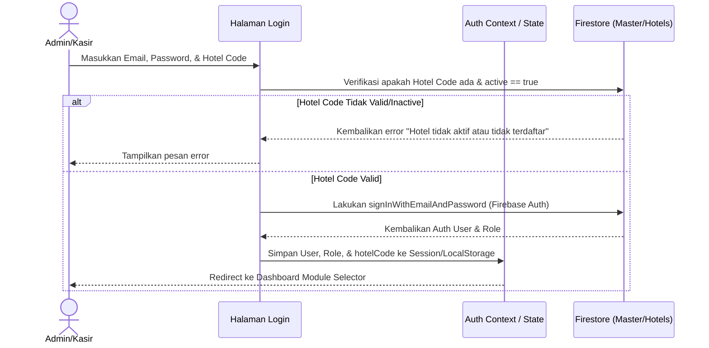

# Dokumentasi Pengembangan & Rencana Multi-Partner CRS (Setara Venture)

Dokumen ini mencatat status terakhir pengerjaan sistem dan memetakan rencana detail pengembangan sistem menjadi **Multi-Hotel Central Reservation System (CRS)** dengan satu basis kode logika, namun basis data yang terisolasi per hotel.
Tolong jangan jalankan pnpm dev, pnpm build dan push ke git sebelum saya perintahkan

> [!IMPORTANT]
> Seluruh tata letak (layout), tombol, radius border, warna, dan tipografi untuk fitur CRS (termasuk halaman `/superadmin`) wajib diselaraskan dengan panduan desain editorial yang terdokumentasi di [Airtable DESIGN.md](file:///f:/WEB-SERVER/WEB/bumi-anyom-web/apps/admin-dashboard/airtable/DESIGN.md) dan mendukung tema Dark/Light secara penuh.

Pastikan semua dibuat dengan full modular, pisahkan setiap section.

---

## 1. Status Terakhir Pengerjaan (Completed)

Berikut adalah perbaikan, optimasi, dan fitur baru yang telah diterapkan dan dipush ke branch `main`:

*   **Dynamic Category P&L Cost & Revenue Routing (POS to P&L)**: Kategori produk POS kini memiliki konfigurasi `pnlTarget` (`FOOD`, `BEVERAGE`, `BANQUET`, atau `OTHER`). Transaksi dengan kategori yang diarahkan ke `OTHER` secara otomatis dialokasikan ke "Other Income" (pendapatan) dan "Other Expenses" (pengeluaran) pada mesin kalkulasi P&L tanpa menggelembungkan metrik F&B A la carte.
*   **Pencegahan Loop Firestore**: Audit pada dashboard `admin-dashboard` dan `Point-of-sales-Nextjs-main` memastikan semua listener `onSnapshot` dilepas (unsubscribed) saat komponen unmount untuk menghindari penggunaan memori berlebih dan ledakan tagihan Firestore.
*   **Cascade Deletion POS**: Penghapusan booking di Overview Dashboard sekarang secara otomatis mencari dan menghapus dokumen transaksi POS yang terkait di koleksi `pos_orders` dan `revenue_transactions`.
*   **Perbaikan Hapus Transaksi POS (Tanpa Batas 10 Hari)**: Handler `DELETE` pada API transaksi POS (`/api/transactions/[id]`) tidak lagi membatasi pencarian `daily_revenue` pada 10 hari terakhir saja. Sistem kini mendeteksi tanggal transaksi asli secara dinamis, mengonversinya ke Waktu Jakarta (`Asia/Jakarta`), lalu langsung mengupdate dokumen `daily_revenue` spesifik (`hotelId_YYYY-MM-DD`).
*   **Pagination & Lazy Loading**: Menambahkan sistem pagination berbasis cursor (`limit` + `startAfter`) pada koleksi besar seperti `roomTypes` dan `gallery` untuk menekan biaya Firestore Read.
*   **Sistem Soft-Delete**: Data transaksi yang dihapus sekarang ditandai dengan flag `isDeleted: true` dan timestamp `deletedAt`. Cloud Function terjadwal secara otomatis membersihkan data yang berumur lebih dari 30 hari secara permanen di latar belakang.
*   **Port Dynamic Redirect**: Redireksi dari dashboard admin ke POS tidak lagi hardcoded ke port `3000`. Dashboard mengirimkan `dashboardUrl` saat mengarahkan user, lalu POS menyimpannya ke `localStorage` agar user dapat diarahkan kembali ke dashboard admin asal secara dinamis di port mana pun aplikasi tersebut berjalan.
*   **Migrasi Database Multi-Hotel**: Telah melakukan kloning data dari database root `bumi-anyom` ke database baru `crs-nexura` di bawah namespace `/hotels/bumi-anyom-resort/...` (sukses tanpa error).
*   **Infrastruktur Helper Query**: Menyediakan `firestoreHelper.ts` di ketiga sub-project (`admin-dashboard`, `Point-of-sales-Nextjs-main`, `landing-page`) untuk mendukung pemanggilan collection dinamis berdasarkan `hotelCode` dengan fallback otomatis ke `root` jika dinonaktifkan.
*   **Superadmin CRS Portal**: Membuat halaman khusus superadmin (`/superadmin`) untuk mendaftarkan tenant hotel baru, mengedit metadata hotel, dan menonaktifkan/mengaktifkan status sistem secara instan.
*   **Inisialisasi Master Hotel**: Menjalankan script `seed_hotels.mjs` untuk mengonfigurasi default metadata hotel pertama `bumi-anyom-resort` di project baru `crs-nexura`.
*   **Format ID Hotel Baru (5 Digit Acak)**: ID/Kode hotel baru sekarang secara otomatis digenerate sebagai angka 5 digit acak (`Math.floor(10000 + Math.random() * 90000)`) dan kolom input kuncinya dinonaktifkan (`disabled={true}`) agar tidak bisa dimanipulasi secara manual.
*   **Migrasi Kode Hotel Bumi Anyom (ke ID 87241)**: Kode hotel untuk Bumi Anyom Resort (partner pertama) berhasil diganti dari `"bumi-anyom-resort"` menjadi kode 5 digit acak `"87241"`. Seluruh referensi kode fallback di codebase Next.js telah diupdate, dan data Firestore telah dimigrasi.
*   **Autentikasi Multi-Hotel & Dropdown Superadmin**: Memperluas `AuthContext.tsx` dan login form agar mendukung input `hotelCode` serta pengecekan status keaktifan hotel. Menampilkan informasi nama hotel yang aktif diawali kode hotel (misal: `[87241] Nama Partner`) pada bagian header aplikasi. Menyediakan dropdown selector dinamis khusus untuk role `superadmin` agar dapat berpindah CRS tenant secara real-time.
*   **Penghapusan Berantai Tenant (Cascade Delete)**: Penambahan fitur penghapusan berantai di Superadmin Portal yang secara rekursif membersihkan seluruh sub-koleksi operasional milik hotel target di Firestore sebelum menghapus dokumen induk hotel. Fitur ini diproteksi dengan modal konfirmasi destruktif yang mengharuskan penulisan ulang kode hotel secara tepat.
*   **Pendaftaran Admin & Welcome Email via Brevo HTTPS**: Pendaftaran hotel baru secara otomatis memicu pembuatan akun administrator baru di Firebase Auth secara server-side (melalui REST API tanpa mengganggu sesi superadmin klien), memetakan data profil `/users_master` ter-modular dengan status full permissions, serta mengapalkan email sambutan HTML premium berisi kredensial login temporer (Link Dashboard, Kode Hotel, Email, & Password) memanfaatkan HTTPS REST API Brevo (Port 443) untuk menghindari pemblokiran port SMTP pada cloud server.
*   **Pemulihan Akun (Forgot Password)**: Mengintegrasikan tautan "Forgot Password?" di halaman login yang membuka form reset password client-side, terintegrasi langsung dengan Firebase Authentication `sendPasswordResetEmail` untuk memicu email pemulihan resmi secara instan.
*   **Pencegahan Bypass Penangguhan Layanan (Deactivation Security Guard)**: Menutup celah bypass status nonaktif hotel (`active === false`) dengan melakukan short-circuit rendering di tingkat layout (`DashboardLayout.tsx` dan `select-module/page.tsx`). Jika properti `active` diubah menjadi `false`, seluruh UI dashboard langsung digantikan total dengan overlay `<BillingSuspendedModal />` fullscreen, menghentikan eksekusi komponen anak dan mencegah Firestore read/write yang tidak sah. Mekanisme serupa diterapkan pada layout POS (`Point-of-sales-Nextjs-main`) untuk memblokir cashier workspace secara real-time.
*   **Akses Sub-Menu CPanel Otomatis bagi Admin**: Menyempurnakan filter sidebar (`Sidebar.tsx`) dan navigasi mobile (`MobileBottomNav.tsx`) agar pengguna dengan role `admin` secara otomatis mendapatkan akses penuh ke seluruh sub-menu dari modul yang aktif/berlangganan (seperti `cpanel-full` untuk semua menu landing page) tanpa perlu dicentang per-item secara manual pada manajemen izin.
*   **Penyempurnaan Fitur Reset Password & Manajemen User**: Memperbaiki hoisting compilation error pada halaman `/users` dengan merelokasi letak inisialisasi helper migration, serta mengimplementasikan reset password personnel secara real-time yang memperbarui data Firestore dan menampilkan password sementara baru via Sonner toast. Native `alert()` / `confirm()` diganti dengan custom `ConfirmModal` ter-modular.
*   **Dynamic Domain Binding & Suspended Guard di Landing Page**: Menyelesaikan implementasi resolusi domain otomatis pada sub-project `landing-page`. Server-side (`getServerSideHotel`) and client-side (`HotelProvider`) kini secara dinamis membaca request host, mencocokkannya ke database `/hotels/{hotelCode}` untuk memetakan konten yang sesuai, serta secara otomatis menampilkan overlay "Sistem Ditangguhkan" jika status hotel adalah `active === false`.
*   **Penyematan Custom Claims & Migrasi Firebase Auth (Next.js API Routes)**: Pemasangan `firebase-admin` SDK pada `admin-dashboard` untuk mengelola personnel di Firebase Auth secara server-side melalui REST API endpoint `/api/users`. Mengonfigurasi `register-admin/route.ts` dan `/api/users` agar secara otomatis menyematkan custom claims (`role`, `hotelCode`) pada token user, serta memperbarui `AuthContext.tsx` dan login form agar langsung membaca claims token (`fbUser.getIdTokenResult()`) dengan fallback query Firestore demi keamanan akses basis data.
*   **Central Billing & Invoice Control (Superadmin Portal - Per Akun)**: Mengimplementasikan dasbor penagihan tabular di `/superadmin` yang membagi modul menjadi *Registry Tenant* dan *Central Billing*. Dilengkapi dengan kalkulasi KPI pendapatan real-time dan panel **Daftar Riwayat Pembayaran (Per Akun)** dinamis dengan dropdown selector. Tim Billing dapat memantau tagihan (Sudah Dibayar / Belum Lunas), mencetak invoice print-friendly (PDF), mengirim email, serta mencatatkan transaksi pembayaran baru (`billing_records`) secara inline dengan fitur *smooth-scroll* navigasi instan tanpa pop-up modal.
*   **Penyederhanaan Hamburger Header Menu & Tombol Sesi (CPanel, User Settings, & Logout)**: Menyederhanakan menu dropdown hamburger di header `/select-module` menjadi tepat 3 opsi: CPanel (mengarahkan langsung ke cpanel lengkap `/logo?module=cpanel`), User Settings, dan Logout. Seluruh styling inline Tailwind pada dropdown telah dipisahkan secara modular ke dalam CSS modules (`select-module.module.css`) untuk kerapian, kebersihan JSX, dan keselarasan dengan tema editorial Bohemian Sage/Gold/Cream. Menghapus tombol logout duplikat di sebelah pemilih tema pada header (`ModuleActionButtons.tsx`) agar tampilan lebih bersih.
*   **Akses Sub-Menu CPanel Otomatis & Pembersihan Sidebar**: Menyempurnakan filter sidebar (`Sidebar.tsx`) dan navigasi mobile (`MobileBottomNav.tsx`) agar saat modul CPanel aktif, menu *User Management* (`users`) dan tombol *Logout* (Keluar) disembunyikan dari sidebar. Selain itu, ketika pengguna mengklik *User Settings* (mengarahkan ke `/users?module=cpanel`), sidebar secara dinamis disaring hanya untuk menampilkan menu *User Management* (dan *Superadmin* jika memiliki hak akses) saja, tanpa menampilkan menu penyiapan landing page lainnya guna memfokuskan pengerjaan.
*   **Optimalisasi Ukuran Card Modul Bento (Workspace Grid)**: Memperkecil dimensi kartu modul bento pada halaman `/select-module` dari `150px` menjadi `130px` pada lebar desktop (dan penyesuaian tinggi dari `155px` menjadi `135px`). Ukuran box ikon, ukuran ikon, padding internal, jarak antar komponen (gap), serta ukuran font judul dan deskripsi diselaraskan lebih proporsional guna menghasilkan visualisasi yang lebih padat, bersih, dan menonjolkan estetika *clean flat corporate design*.
*   **Modularisasi Penuh Halaman Superadmin (`/superadmin`)**: Halaman superadmin yang sebelumnya monolitik (~800+ baris) dipecah total menjadi komponen-komponen modular terpisah, masing-masing dalam file sendiri di direktori `app/(dashboard)/superadmin/`.
*   **Logo Header Click-to-Home (Dynamic Port)**: Logo di header dashboard (`DashboardLayout.tsx` dan halaman lain) kini berfungsi sebagai tautan kembali ke halaman `/select-module`, dengan dukungan dinamis port. Klik logo akan mengarahkan user kembali ke halaman pemilihan modul baik di port `3000` maupun `3001`, tanpa hardcode URL.
*   **Redesign Enterprise Card Select-Module**: Tampilan kartu modul pada halaman `/select-module` (`ModuleBentoGrid.tsx`) didesain ulang total dengan pendekatan *clean international corporate* menggunakan warna aksen unik (icon color) untuk membedakan identitas visual secara intuitif.
*   **Standarisasi Desain Struk (Thermal Receipt)**: Mengembangkan komponen `ThermalReceipt.tsx` tunggal yang melayani halaman Kasir (`/lexupos`) dan Riwayat Transaksi (`/records/[id]`). Menggunakan tipografi *sans-serif* modern (Inter), menampilkan logo restoran dinamis dengan jarak proporsional, menyertakan terjemahan baku (TUNAI, QRIS, KARTU, Uang Kembali), serta ditutup dengan footer *Powered by* bergaya profesional.
*   **Optimalisasi Layout Cetak (Print View) LexuPos**: Menerapkan injeksi *CSS Print Media Queries* (`print:hidden`, `print:block`, `print:p-0`) pada kerangka utama *layout* POS dan dialog LexuPos. Ini menjamin proses cetak browser (termasuk *Save as PDF*) secara mulus hanya menangkap komponen struk kertas 80mm yang bersih tanpa mengekspos tombol navigasi, sidebar, atau elemen UI lainnya. Popup kasir juga dibuat responsif dan *scrollable* untuk struk panjang.
*   **Fitur Compliment Front Office (Kompensasi/Gratis)**: Menambahkan fungsionalitas penandaan pesanan kamar dan pendapatan lain (Other Income) sebagai *Compliment* pada form `/forecast/add`. Nilai rate kamar yang digratiskan (*complimentValue*) terekam dan ditampilkan secara khusus di dashboard P&L bagian Room Revenue pada kartu "Room Compliment", tanpa menambah kas masuk.
*   **Penyempurnaan UI/UX Portal Absensi Karyawan (iOS Aesthetic)**: Melakukan desain ulang secara menyeluruh pada antarmuka pengguna portal absensi mandiri (`/attendance`). Mengadopsi gaya *widget* Apple iOS premium (sudut membulat 28px, bayangan tebal elegan, kontainer *off-white*). Menanamkan pengaman khusus (`.force-light-input`) di `globals.css` untuk mencegah tabrakan *Dark Mode* paksa dari sistem pada elemen form, serta mengimplementasikan ucapan sapaan dinamis berdasarkan zona waktu Asia/Jakarta secara *real-time*.
*   **Formulir Onboarding & Templat Email Setara Venture (B2B Rebranding)**: Menghapus seluruh referensi label "Nexura" pada halaman formulir onboarding, subjek, header, dan footer email, serta menggantinya secara menyeluruh dengan "Setara Venture" beserta email kontak bantuan `admin@setaraventure.com`.
*   **Penyesuaian Istilah Partner & Partner Code**: Mengubah kata "Tenant" menjadi "Partner" dan istilah "Hotel Code" menjadi "Partner Code" di seluruh form login, modul pendaftaran, dasbor superadmin, email onboarding, dan riwayat pembayaran guna memperkuat kesan B2B.
*   **Perbaikan Responsivitas & Scroll Halaman Onboarding**: Mengatasi masalah pengguliran halaman (unscrollable) akibat tabrakan aturan global `overflow: hidden` pada `body` dashboard, dengan mendefinisikan layout bertumpuk (`position: fixed`) mandiri dengan pengguliran otomatis (`overflow-y: auto`) dan `z-index` tinggi agar tetap dapat diakses penuh baik di perangkat mobile maupun PC.
*   **Format Sandi Sementara Setara**: Menyesuaikan format pembuatan kata sandi sementara akun administrator baru dari `Nexura[KodeHotel]!` menjadi `Setara[KodeHotel]!`.
*   **Penyembunyian Akun Superadmin di Client Workspace**: Membatasi tampilan daftar pengguna di `/users?module=cpanel` agar tidak menampilkan akun-akun dengan peran `superadmin`, serta menghapus pilihan peran `superadmin` saat pembuatan user baru demi privasi dan keamanan master data Setara Venture.
*   **Penyaringan Otorisasi Izin Sesuai Paket Workspace**: Menghubungkan visualisasi tabel izin di `/users?module=cpanel` agar selalu disaring secara dinamis mengikuti modul paket pembelian (*activeModules*) milik hotel partner, termasuk bagi akun `superadmin` yang sedang meninjau hotel tersebut, serta membersihkan submenu *Technologies* (`pos_technologies`) secara menyeluruh dari database klaim.
*   **Pengaman Input Numerik P&L**: Mengamankan seluruh input bertipe angka (`type="number"`) di modul P&L untuk mencegah kelalaian operasional. Seluruh input angka kini dilengkapi pengaman anti-scroll wheel (`onWheel` blur) dan anti-karakter minus/plus/eksponensial (`onKeyDown` preventDefault), serta tombol spinner atas-bawah telah disembunyikan secara visual melalui modifikasi CSS global.
*   **Menu POS Real-time di F&B Product**: Menyediakan tab baru **POS Real-time** pada modul F&B Product untuk memantau denah meja aktif (terintegrasi dengan `pos_held_orders` secara real-time) serta menampilkan stream pesanan masuk baru (held orders & completed orders) lengkap dengan notifikasi indikator pesanan baru.
*   **Detail Payment di Queue List (Forecast Terminal)**: Menampilkan detail pembayaran secara transparan di tabel antrean transaksi FO (`/forecast/add`) yang memecah nominal Cash (`payHotel`) & Transfer/OTA (`payTransfer`), menampilkan sisa tagihan/due (`balanceVal`), serta menyematkan status pembayaran terstandar (`LUNAS`, `DP`, `BELUM BAYAR`) secara instan.
*   **Penyelarasan Status Pembayaran Front Office**: Menstandardisasi properti `paymentStatus` di level pembuatan entri (`useTransactionForm.ts`) dengan label string bahasa Indonesia `"Lunas"`, `"Belum Bayar"`, dan `"DP / Partial"`. Ini menghilangkan perulangan pembacaan (double looping) di UI/Firestore dan menyinkronkan data langsung dengan Overview Dashboard.
*   **Pengakuan Akuntansi Transaksi Compliment (Buku Besar & P&L)**:
    - **Buku Besar**: Mengotomatisasi penjurnalan transaksi compliment. Transaksi tanpa kas masuk kini didebit ke Beban Operasional (`502-000`) dan dikredit ke Pendapatan terkait (`401-000` Kamar / `409-000` Lainnya) sebesar nilai komersial asli (`complimentValue`), menjaga Neraca tetap seimbang tanpa mempengaruhi akun Kas & Bank.
    - **P&L Engine**: Menambahkan nilai compliment ke Total Pendapatan Kotor (`Total Revenue`) dan Total Beban Operasional secara seimbang (*balanced*), menjaga Net Profit Rp 0, serta mengecualikan nilai compliment dari perhitungan VAT, Service Charge, dan Lost & Breakage.
*   **Penyelarasan Laporan Arus Kas dengan Neraca & Buku Besar**: Menyempurnakan Laporan Arus Kas (`CashFlow.tsx`) menggunakan Metode Langsung yang ditenagai data transaksi riil (`rawTransactions`, `fixedAssetsValue`, `vatPaid`, `feePaid`, `scPaid`, `lbPaid`). Saldo kas akhir (`endingBalance`) kini sinkron dan seimbang secara presisi dengan akun Kas & Bank (`cashAndBank`) pada Neraca.
*   **Arsitektur Integrasi Purchasing & Akuntansi (Opsi 2 - Invoice-Based)**: Menyepakati arsitektur pelaporan terintegrasi di mana beban P&L dan Hutang Dagang (Accounts Payable) diakui di Neraca pada saat Invoice Supplier diverifikasi/diterima (barang diterima & tagihan cocok), sedangkan kas/bank baru dipotong di Buku Besar dan Arus Kas pada saat pembayaran/pelunasan diselesaikan.
*   **Sistem Pemesanan Mandiri Tamu (Guest Self-Ordering GrabFood Style) & Live Audio Alert Kasir/F&B**:
    - **Guest Self-Ordering Web App (`/cafe-resto`)**: Berhasil mentransformasi halaman cafe-resto menjadi antarmuka pemesanan mandiri tamu (GrabFood/GoFood style) dengan promo slider horizontal, navigasi kategori smooth-scroll, keranjang mengambang bawah (floating cart), checkout drawer terintegrasi nomor meja, serta metode pembayaran kasir / transfer BCA lengkap dengan upload bukti transfer langsung ke Firebase Storage.
    - **Live Audio Alert & Toast Notifikasi**: Berhasil menambahkan listener `onSnapshot` yang mendeteksi pesanan mandiri tamu baru (`Self-Order Tamu` dengan status `PENDING`) pada POS Cashier layout (`Point-of-sales-Nextjs-main/app/(root)/layout.tsx`) dan F&B monitor tab (`admin-dashboard`), memutar bel notifikasi chime secara instan, menampilkan toast visual secara real-time, serta mengisolasi path Firestore per hotel partner `/hotels/{hotelCode}/pos_held_orders` untuk keamanan multi-tenant.
*   **Penyelesaian Isu Lintas Tenant Superadmin & Interkoneksi POS**: Mengganti pengambilan data list hotel di `onSnapshot` menggunakan ID dokumen (`doc.id`), menjamin daftar *partner* Setara Venture muncul sempurna di dropdown Superadmin. Memberikan hak akses tanpa batas (*God Mode*) di POS agar superadmin kebal terhadap batasan paywall. Menyapu bersih noda *hardcode* teks "Bumi Anyom Resort" di seluruh komponen, dan membakukannya menjadi desain *neutral multi-tenant* (Partner Property).
*   **Dynamic Middleware Subdomain Absensi**: Middleware sekarang secara dinamis mendukung akses via `staff.mytara.id/?h=KODE_HOTEL` untuk semua partner. Tidak ada lagi hardcode di level middleware. Penambahan partner baru langsung aktif tanpa perlu redeploy.
*   **Penyederhanaan Struk POS & Optimasi KOT Dapur/Bar**:
    - **Struk Kasir (Full)**: Menyederhanakan detail struk kasir dengan menghapus baris subtotal per kategori yang berulang, namun tetap mempertahankan pemisahan visual header kategori agar struk tetap teratur dan rapi.
    - **Tiket Dapur & Bar**: Mendesain ulang layout produksi dengan menempatkan angka kuantitas berukuran besar (`16px font-bold`) dalam kotak kontras tinggi di sebelah kiri, menggunakan huruf kapital penuh (uppercase) pada nama menu, serta membungkus catatan request khusus ke dalam box dengan border hitam tebal (`border-2 border-black`) agar sangat terlihat jelas dan mencegah salah racik (*matched-order protection*).
*   **Perbaikan Compile Error bentodemo.tsx**: Menyelesaikan isu build failure di repositori POS dengan menambahkan impor `setDoc` yang tertinggal pada komponen `bentodemo.tsx`, memulihkan proses deployment berjalan normal.
---

## 2. Arsitektur Multi-Hotel CRS (Roadmap)

### A. Strategi Isolasi Database Firestore
Untuk mendukung banyak hotel dengan satu logika sistem, kita akan menerapkan **Single Project - Dynamic Path Isolation**. 

Struktur database master akan memiliki satu koleksi utama bernama `hotels` sebagai registry data config masing-masing hotel. Data operasional hotel akan dipisahkan menggunakan sub-koleksi di bawah dokumen hotel tersebut:

```text
/hotels (Koleksi Master)
  ├── [hotelCode: 87241] (Dokumen Partner A)
  │     ├── name: "Partner Property Name"
  │     ├── active: true
  │     ├── domain: "resort.partner.com"
  │     ├── billingStatus: "paid"
  │     └── ... metadata hotel
  │     /* Sub-koleksi Data Operasional Partner A */
  │     ├── roomTypes (Koleksi)
  │     ├── packages (Koleksi)
  │     ├── pos_orders (Koleksi)
  │     ├── daily_revenue (Koleksi)
  │     └── revenue_transactions (Koleksi)
```

---

### B. Flow Autentikasi & Login Baru
Untuk masuk ke sistem CRS, alur login akan diubah sebagai berikut:



---

### C. Menu Superadmin (CRS Central Portal)
Superadmin memerlukan satu dashboard sentral untuk mengontrol semua tenant/hotel. Halaman ini diproteksi hanya untuk user dengan role `superadmin`.

---

### D. Flow Landing Page Otomatis (Dynamic Domain Binding)
Untuk landing page (port `3002` atau hosting web publik), hotel tidak perlu mendeploy ulang source code frontend baru. Aplikasi landing page akan membaca data secara dinamis berdasarkan URL yang diakses oleh tamu/pengunjung.

---

### E. Struktur Dokumen Master `/hotels` secara Detail
Setiap dokumen di `/hotels/{hotelCode}` memiliki skema standar untuk menyimpan konfigurasi hotel, domain custom, detail kontak, dan pengaturan billing.

---

### F. Aturan Keamanan (Firebase Security Rules) Multi-Tenant
Firebase Security Rules dikonfigurasi untuk mengecek parameter `hotelCode` pada klaim token user (`auth.token.hotelCode`) guna mencegah kebocoran data antar hotel.

---

### G. Alur Penanganan Status Inactive (System Suspended)
Jika status `active` diubah menjadi `false`, seluruh UI dashboard langsung digantikan total dengan overlay `<BillingSuspendedModal />` fullscreen, menghentikan eksekusi komponen anak dan mencegah Firestore read/write yang tidak sah.

---

### H. Panduan Spacing, Padding & Tata Letak (DESIGN.md Aligned)
Desain layout editorial menggunakan spacing terstandarisasi:
1. **Page Container**: Padding penuh `32px` (`p-8`).
2. **Card & Card Content**: Background `bg-[#faf8f4]` / `dark:bg-[#262626]`, border tipis, padding `32px` (`p-8`).
3. **Table Spacing**: Table headers (`th`) padding `px-8 py-3`, data cells (`td`) padding `px-8 py-4`.

---

## 3. Rencana Ke Depan (Future Roadmap - Belum Dijalankan)

Berikut adalah rencana pengembangan lanjutan yang belum diimplementasikan di environment production:

*   **Otomatisasi Cron Job Pengecekan Billing (Central Billing Worker)**:
    *   Buat Cloud Functions terjadwal (misal harian) yang mencocokkan `billing.nextDueDate` dengan tanggal sekarang dan menonaktifkan tenant secara otomatis jika terlewat masa tenggang.

*   **Pengembangan Modul Absensi Multi-Hotel — Opsi C (Route di Admin Dashboard)**:

    **Arsitektur (Hybrid Auth)**: Karyawan mengakses halaman absensi melalui QR Code yang dicetak/dipasang di hotel. QR Code mengarah ke URL khusus di admin dashboard (`/attendance`) yang tampil tanpa sidebar, mobile-first. **Karyawan tidak dimasukkan ke dalam Firebase Authentication** untuk menghemat limit/biaya (Hybrid). Data staf disimpan sebagai dokumen Firestore di koleksi `/hotels/{hotelCode}/staff`. Login karyawan pada sistem absensi dilakukan cukup menggunakan Employee ID / PIN. HRD mengelola semua data lewat route `/hrd` di dalam dashboard yang sama. Tidak ada sub-project baru — semua berjalan dalam satu server `admin-dashboard`.

    **Flow Karyawan (HP via QR Scan)**:
    ```
    Scan QR → Buka /attendance → Login (Employee ID + PIN / Password + Hotel Code)
         → Tampil halaman absensi isolasi (tanpa sidebar dashboard)
         → Clock In: Ambil Selfie → Validasi GPS (radius ≤ 50m dari koordinat titik lokasi HRD)
         → Clock Out: Ambil Selfie → Sistem hitung durasi kerja otomatis
         → Pengajuan: Izin / Sakit (upload surat) / Cuti / Alpa
    ```

    **Flow HRD/Admin (`/hrd` di Dashboard)**:
    ```
    Login sebagai Admin/HRD → Masuk ke modul HRD
         ├── Manajemen Staf: Input data karyawan (nama, posisi/jabatan, divisi, shift, PIN Akses)
         ├── Manajemen Shift: Buat & atur shift (jam masuk, jam keluar, toleransi)
         ├── Setting Lokasi: Input koordinat GPS hotel & radius absensi untuk validasi Clock-in
         ├── Monitor Live: Tabel absensi hari ini semua karyawan (real-time)
         ├── Approval: Terima/tolak pengajuan Izin, Sakit, Cuti
         ├── Koreksi Manual: Koreksi absensi dengan catatan alasan (audit trail)
         ├── Kalkulasi Lembur: Jam kerja > jam shift → flagged, HR double-check & approve/reject
         ├── Plotting Shift Fleksibel: Mengatur jadwal dinamis untuk karyawan yang tidak memiliki shift tetap
         └── Push Notification: Mengirim pengumuman/peringatan ke portal absen (mendukung broadcast massal 1 pesan untuk semua, atau custom pesan berbeda per karyawan spesifik)
    ```

    **Flow Tim ACC/Payroll (`/hrd` → Laporan Bulanan)**:
    ```
    Pilih periode (bulan/tahun) → Pilih karyawan / semua → Generate laporan
         ├── Tabel rekap per karyawan: Hadir | Sakit | Izin | Alpa | Lembur (jam)
         ├── Filter per divisi / posisi
         └── Ekspor Excel / PDF → Digunakan untuk proses penggajian
    ```

    **Struktur Data Firestore**:
    ```text
    /hotels/{hotelCode}/
      ├── staff/                   ← Data karyawan (nama, posisi, divisi, shift, PIN, auth_type)
      ├── shifts/                  ← Definisi shift (pagi, siang, malam)
      ├── attendance/{yyyy-mm}/    ← Log absensi per bulan
      │     └── {userId_date}      ← clock_in, clock_out, selfie_url, gps, durasi, lembur
      └── leave_requests/          ← Pengajuan izin/sakit/cuti/alpa + status approval
    ```

    **Fitur Lengkap yang Akan Dibangun**:
    | Fitur | Keterangan | Status |
    |---|---|---|
    | QR Code Login | QR dicetak/dipasang di hotel → arah ke `/attendance` | ✅ Selesai |
    | Clock In/Out + Selfie | Selfie wajib sebelum absensi tersimpan | ✅ Selesai |
    | GPS Geofencing | Validasi koordinat dalam radius yang ditentukan HRD | ✅ Selesai |
    | Manajemen Staf | Input nama, posisi, divisi, shift default per karyawan | ✅ Selesai (Tanpa Default Shift) |
    | Manajemen Shift | Pagi/Siang/Malam + jam toleransi keterlambatan | ✅ Selesai |
    | Status Absensi | Hadir, Sakit, Izin, Alpa, Cuti | ✅ Selesai |
    | Pengajuan Online | Karyawan ajukan Izin/Sakit via app, upload surat | ✅ Selesai |
    | Approval HRD | HRD approve/reject pengajuan secara real-time | ✅ Selesai |
    | Kalkulasi Lembur | Otomatis deteksi jam kerja > jam shift, HR double-check | ✅ Selesai |
    | Koreksi Manual | Admin bisa koreksi absensi dengan audit trail | ✅ Selesai |
    | Laporan Bulanan | Rekap per karyawan, filter divisi, ekspor Excel/PDF | ✅ Selesai |
    | Plotting Shift Fleksibel | Mengakomodasi karyawan dengan jadwal tidak teratur via UI Kalender HRD | ✅ Selesai |
    | Broadcast & Targeted Notification HRD | Alert notifikasi libur (Hari H & H-1), pengumuman spesifik/massal | ✅ Selesai |

    **Pemetaan Logika Shift Fleksibel & Notifikasi Karyawan**:
    1. **Shift Fleksibel (Dynamic Scheduling)**:
       - **Struktur Data**: Selain `shiftId` default di profil `/staff`, HRD dapat menyematkan sub-koleksi `/staff/{staffId}/schedules/{date}` untuk menimpa shift default pada hari tertentu.
       - **Logika Clock-In**: Saat karyawan memindai QR, sistem mengecek apakah ada jadwal khusus (override) untuk hari ini (`YYYY-MM-DD`). Jika ada, gunakan batas waktu dari jadwal khusus. Jika tidak, fallback ke `shiftId` default profil.
       - **UI HRD**: Kalender dinamis di mana HRD dapat *drag-and-drop* karyawan ke slot waktu untuk plotting mingguan/bulanan.

    2. **Sistem Notifikasi Karyawan (Targeted & Broadcast)**:
       - **Struktur Data**: Data disimpan di `/hotels/{hotelCode}/announcements/{id}` dengan opsi `target: "all" | "specific"` dan `targetStaffIds` berupa array.
       - **Logika Portal Absen**: Saat karyawan login, aplikasi mengunduh data pengumuman yang `active == true`.
       - **Filter Tampilan**: Komponen hanya menampilkan pesan jika `target === "all"` ATAU `targetStaffIds.includes(currentUser.id)`. Rendering dibedakan warnanya berdasarkan tipe pengumuman (Info = Biru, Warning = Kuning/Merah, Success = Hijau).


*   **WhatsApp Gateway API Integration**:
    *   Mengirimkan rincian e-receipt checkout Front Office, e-invoice pesanan POS, serta konfirmasi registrasi personnel baru langsung ke WhatsApp tamu/staff.
*   **Laporan Akuntansi Terintegrasi (Buku Besar, Neraca, & Arus Kas)**:
    *   Menghubungkan seluruh data transaksi operasional Front Office dan POS ke dalam Laporan Keuangan Neraca (Balance Sheet) dan Laporan Arus Kas (Cash Flow) otomatis secara periodik.
*   **Customer Ordering Menu (Landing Page Integration)**:
    *   Mengintegrasikan menu pemesanan langsung dari tamu/kustomer melalui Landing Page. Fitur ini dirancang khusus untuk paket Enterprise (atau minimal paket Bisnis) untuk memberdayakan restoran/tenant menjual produk secara online (Self-Order).

---

## Checklist Hari Ini (17-18 Juni 2026)

- [x] Menyempurnakan Tampilan UI/UX Portal Absensi ala Widget iOS Premium
- [x] Mengatasi Bug CSS Dark Mode pada Input Form Absensi
- [x] Menambahkan sapaan dinamis berdasarkan Waktu Jakarta
- [x] Memetakan Arsitektur Pengembangan Shift Fleksibel & Sistem Notifikasi Karyawan (Selesai)
- [x] Mendokumentasikan peta struktur *folder* dan *file* sistem absensi secara lengkap
- [x] Implementasi Fitur Plotting Shift Fleksibel di Panel HRD (Menghapus default shift, UI Filter, dll)
- [x] Implementasi Sistem Peringatan Libur (Casual Alert: Hari H & H-1) di Portal Karyawan
- [x] Integrasi Pemaketan Tenant (Startup, Bisnis, Enterprise) pada Portal Superadmin
- [x] Sinkronisasi Filter Hak Akses Modul berdasarkan Paket Tenant pada Halaman Manajemen User (`/users`)
- [x] Perbaikan Bug *Bypass* Superadmin: Memastikan Superadmin yang masuk ke *workspace* Tenant hanya melihat modul sesuai paket yang dibeli tenant tersebut (Isolasi Modul)
- [x] Pembersihan *Grid Dashboard* (`/select-module`): Menyembunyikan dan menghilangkan secara total (*clean look*) kartu-kartu modul yang tidak di-*subscribe* oleh tenant, agar UI tidak penuh dengan kartu "samar/disabled".
- [x] Penyesuaian Dinamis *Sidebar* dan *Mobile Navigation* mengikuti rute paket tenant.
- [x] Mengamankan seluruh Input Numerik P&L (Pencegahan scroll-wheel blur, pencegahan input negatif/minus, dan pembersihan spinner up/down)
- [x] Implementasi Menu POS Real-time Monitor (Meja On & Order Stream) di F&B Product Page
- [x] Integrasi Menu POS Real-time ke Sidebar F&B & Standardisasi Layout, Padding, & Radius sesuai DESIGN.md (Desktop & Mobile Nav)
- [x] **Penyempurnaan UI/UX Pemesanan Mandiri (Self-Order GrabFood Style)**:
    - Merestrukturisasi *Header* dengan tema warna solid (*House Green*) penuh dari ujung ke ujung.
    - Membersihkan tombol CTA yang berlebih pada *Hero Banner* untuk menonjolkan estetika foto.
    - Menerapkan *Full-Width Fluid Layout* yang merespons mulus di layar mendatar (*landscape*/PC) tanpa kekangan pembatas sempit (menghilangkan *bug* sisi kosong/kolom pilar).
    - Mengamankan proporsi gambar *Hero Banner* dengan tinggi absolut yang dinamis agar tidak membesar gahar (terlalu besar) secara vertikal di desktop.
    - Mensinkronkan tatanan *Grid* Kartu Menu agar berevolusi secara modular (2 hingga 6 kolom) mencegah kartu berubah raksasa.
    - Mengunci kontainer gambar produk secara permanen pada rasio kotak 1:1 sempurna menggunakan *Absolute Padding Trick* (`pt-[100%]`). Hal ini membasmi masalah teks judul/deskripsi yang bergelombang ("naik turun") dan mensejajarkan seluruh teks konten pada satu garis lurus yang memanjakan mata.
- [x] **Penyelesaian Isu Lintas *Tenant* Superadmin & Interkoneksi POS**:
    - **Penyelesaian Bug `hotelCode` Dropdown**: Mengganti rujukan properti data tak utuh (`doc.data().hotelCode`) dengan basis ID absolut (`doc.id`) pada pengambil data waktu nyata (`onSnapshot`). Hal ini menjamin daftar *partner* Setara Venture muncul paripurna bagi superadmin baik di port 3000 maupun 3001.
    - **Pembongkaran Blokade *Infinite Loop***: Menghapus mekanisme pencegat *session* (`checkSession` pada `AuthContext.tsx`) yang secara paksa menimpa *cache* pemilihan hotel superadmin kembali ke *fallback* "0". Perbaikan ini memberi kemampuan penjelajahan modul tenant (*preview*) sepenuhnya tanpa terkunci di halaman asal.
    - **Hak Akses Tanpa Batas (*God Mode*) di Pengaturan POS**: Mengukuhkan kekebalan khusus (bypass) di komponen `/components/setting/components/selforder.tsx` agar superadmin kebal terhadap batasan paywall berlangganan "Enterprise" milik tenant.
    - **Normalisasi Teks Pemuatan Data (*Loading Fallback*)**: Menyapu bersih sisa noda *hardcode* nama "Bumi Anyom Resort" yang tayang sekilas selama sistem membaca basis data pada komponen tajuk *header* (baik di Admin maupun POS) dan membakukannya menjadi `"Memuat..."` bergaya *neutral multi-tenant*.
- [x] **Pembersihan Total Hardcode Domain Statis**: Menyapu bersih semua jejak referensi *hardcode* domain lama (`pos.bumianyom.com` dan `pms.bumianyom.com`) di seluruh ekosistem (Admin Dashboard & POS), dan menggantinya dengan sistem resolusi domain dinamis yang mengarah pada infrastruktur resmi Setara Venture (`point.mytara.id` dan `live.mytara.id`).
- [x] **Perbaikan Rendering Favicon Production**: Mendefinisikan ulang *property* `icons` secara eksplisit pada lapisan Metadata Layout utama di `admin-dashboard` dan `Point-of-sales-Nextjs-main` untuk membasmi *bug* hilangnya Favicon saat aplikasi di-*deploy* ke Firebase App Hosting.
- [x] **Zero-Tolerance Audit untuk TypeScript & Next.js 15 ESLint (POS)**: Menyelesaikan rentetan kegagalan *deploy* di infrastruktur Cloud Build dengan melakukan audit *build* lokal berulang kali hingga hijau 100%, meliputi:
    - Melakukan eskapasi *HTML Entities* (`&quot;`) untuk mengamankan karakter kutip ganda pada `CartCheckout.tsx`, `POSCartSidebar.tsx`, dan `PaymentWorkspace.tsx`.
    - Menginjeksi properti tipe data yang hilang (`description`, `addons`) ke dalam basis antarmuka IndexedDB `LocalProduct` (`lib/dexie.ts`).
    - Menyempurnakan pemaksaan tipe spesifik (*Type Assertion* `as string[]`) pada operasi `filter(Boolean)` guna mematuhi aturan strict mode penyaringan subkategori POS (`useLexuPos.ts`).
    - Mengintegrasikan atribut `isCompliment`, `complimentReason`, `paymethod`, dan `paymentMethod` secara resmi ke dalam konstruktor tipe `TransactionData` untuk melindungi rendering di halaman cetak rekam jejak kasir (`records/[id]/page.tsx`).
    - Menghapus deklarasi kunci duplikat (`stock`) di dalam *Object Literal* yang diatur ketat oleh kompiler mutakhir Next.js (`self-order/[hotelCode]/page.tsx`).
    - Merancang perlindungan *Null Safety* (`?.trim()`) pada variabel `tableNumber` untuk mencegah *Runtime Crash* saat pemesanan nirkabel tamu.
    - Merestrukturisasi parameter React `useRef` menggunakan definisi generik mutakhir `RefObject<HTMLDivElement | null>` agar serasi dengan standar baru modul `CategoryNav`.
- [x] **Pembersihan Total Hardcode Spesifik Partner (Bumi Anyom -> Setara Venture)**: Menyapu bersih semua jejak referensi *hardcode* teks "Bumi Anyom" di seluruh komponen PDF Print, form, dropdown superadmin, dan UI menjadi generic "Partner Property" atau terhubung langsung secara dinamis dengan nama properti dari Firestore.
- [x] **Dynamic Middleware Routing untuk Subdomain Absensi**: Memperbarui middleware `admin-dashboard` untuk mem-bypass deteksi subdomain statis dan beralih menggunakan param `?h=` sepenuhnya untuk akses via `staff.mytara.id/?h=KODE_HOTEL`, memastikan otomatisasi penambahan tenant baru tanpa perlu *redeploy* kode.
- [x] **Pemantapan Arsitektur Landing Page & Company Profile**: Mendokumentasikan keputusan strategis bahwa modul Landing Page (port 3002) sepenuhnya digerakkan oleh *Dynamic Host Binding* dan bebas-*deploy* hingga terbit pesanan modul.

---

## 4. Pemetaan Struktur Folder & File Modul Absensi (Opsi C)

Untuk memudahkan navigasi dan referensi arsitektur Modul Absensi & HRD yang telah dibangun, berikut adalah peta lengkap jalur (*path*) dan fungsi dari seluruh komponen di dalam *source code*:

### A. Portal Karyawan (Mobile-First UI)
**Jalur Target:** `apps/admin-dashboard/app/attendance/`
Modul antarmuka *standalone* tanpa *sidebar* yang diakses oleh karyawan via pindaian QR Code (Estetika iOS Premium).

*   `layout.tsx` - Pembungkus halaman khusus absensi untuk mengisolasi layout dari *dashboard* utama.
*   `page.tsx` - Halaman eksekusi utama dengan logika deteksi zona waktu otomatis.
*   `attendance.module.css` - Pengaturan gaya modular UI/UX absensi.
*   **`/components/` (Logika Fungsional Utama):**
    *   `ClockInOutCard.tsx` - Kartu *widget* mesin absensi utama (Tombol In/Out & jam).
    *   `LeaveRequestForm.tsx` - Formulir pengajuan izin, cuti, dan lampiran surat sakit.
    *   `SelfieCapture.tsx` - Antarmuka akses kamera web/HP untuk memotret bukti kehadiran.
    *   `GpsValidator.tsx` - Pemroses koordinat geolokasi untuk mencegah absensi di luar jangkauan radius hotel.
    *   `ShiftStatusBadge.tsx` - Lencana indikator keterlambatan/durasi shift.
    *   `AttendanceHistory.tsx` - Tabel histori/jejak rekam mandiri bagi staf.

### B. Modul Manajemen HRD (Admin CPanel)
**Jalur Target:** `apps/admin-dashboard/app/(dashboard)/hrd/`
Modul dasbor manajerial yang hanya bisa diakses oleh *user* dengan hak akses khusus (HRD/Admin).

*   `page.tsx` - Halaman *routing* induk untuk memuat seluruh modul HRD.
*   `hrd.module.css` - Desain *grid/table* standar untuk tampilan *enterprise dashboard*.
*   `types.ts` - *Source of truth* untuk definisi struktur antarmuka data TypeScript secara sistemik.
*   `HrdTabs.tsx` - Navigasi *tab* pengatur saklar menu (Live Monitor, Manajemen, Laporan, dll).
*   **Komponen Basis (Pengaturan):**
    *   `GpsSettingCard.tsx` - Pusat pengaturan letak kordinat absolut hotel dan lebar zona radius (meter).
    *   `CompanySettingCard.tsx` - Data kop perusahaan untuk cetakan.
    *   `AnnouncementSettingCard.tsx` - Pusat kontrol *Broadcast & Targeted Notification* HRD ke karyawan. Mendukung pengiriman massal (all) maupun kustom multi-pesan ke karyawan spesifik (Dalam pengembangan).
    *   `QrCodeDisplay.tsx` - Penghasil QR Code untuk ditempel di mading karyawan.
*   **Komponen *Data Entry* (Pendaftaran):**
    *   `StaffTable.tsx` / `StaffFormModal.tsx` - Tabel & Form perekrutan staf baru serta pengaturan PIN *login*.
    *   `ShiftTable.tsx` / `ShiftFormModal.tsx` - Tabel penetapan ragam tipe jam masuk dan pulang kerja.
*   **Komponen Monitoring & *Approval*:**
    *   `LiveMonitorTable.tsx` - Tabel "radar" pemantau karyawan yang sudah/belum absen hari ini (*real-time*).
    *   `LeaveApprovalTable.tsx` - Wadah HRD menyetujui/menolak pengajuan cuti/izin/sakit masuk.
    *   `OvertimeApprovalTable.tsx` - Dasbor validasi klaim jam lembur staf.
*   **Komponen Penyesuaian & Pelaporan (*Payroll*):**
    *   `StaffLogModal.tsx` - Penampil rincian detail absen staf per individu secara mendalam.
    *   `ManualCorrectionModal.tsx` - Fitur perbaikan data absen secara manual oleh HRD disertai catatan audit.
    *   `MonthlyReportTable.tsx` / `ReportDataGrid.tsx` / `ReportFilterBar.tsx` - Set perakitan rekapitulasi data kehadiran bulanan.
    *   `ExportReportButton.tsx` - Generator unduhan fail PDF/Excel mutlak untuk keperluan penggajian.