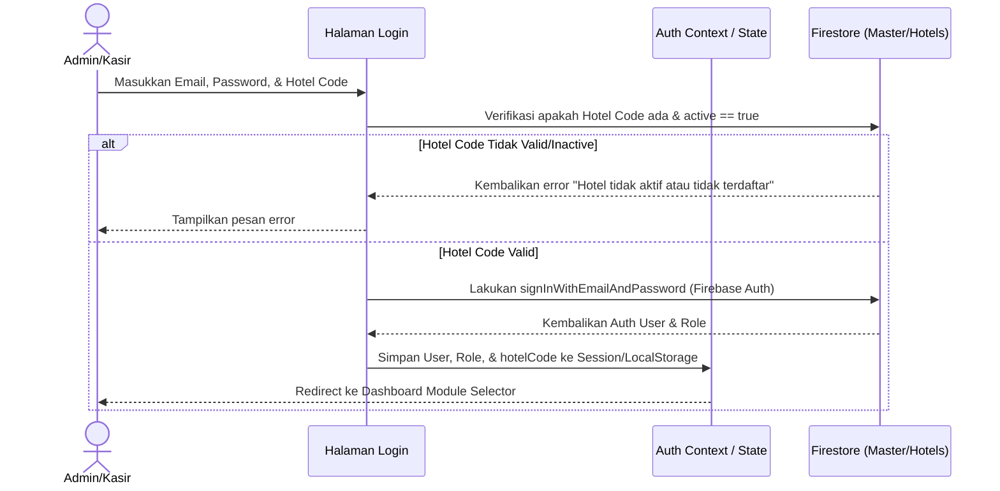
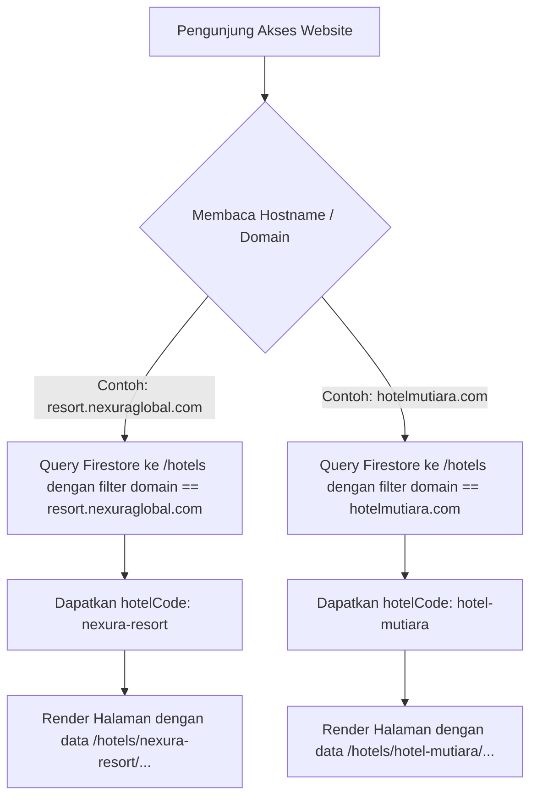

# Dokumentasi Pengembangan & Rencana Multi-Hotel CRS (Nexura Global Hospitality)

Dokumen ini mencatat status terakhir pengerjaan sistem dan memetakan rencana detail pengembangan sistem menjadi **Multi-Hotel Central Reservation System (CRS)** dengan satu basis kode logika, namun basis data yang terisolasi per hotel.
Tolong jangan jalankan pnpm dev, pnpm build dan push ke git sebelum saya perintahkan

> [!IMPORTANT]
> Seluruh tata letak (layout), tombol, radius border, warna, dan tipografi untuk fitur CRS (termasuk halaman `/superadmin`) wajib diselaraskan dengan panduan desain editorial yang terdokumentasi di [Airtable DESIGN.md](file:///f:/WEB-SERVER/WEB/bumi-anyom-web/apps/admin-dashboard/airtable/DESIGN.md) dan mendukung tema Dark/Light secara penuh.

pastikan semua dibuat dengan full modular, pisahkan setiap section
---

## 1. Status Terakhir Pengerjaan (Completed)

Berikut adalah perbaikan dan optimasi yang telah diterapkan dan dipush ke branch `main`:

*   **Pencegahan Loop Firestore**: Audit pada dashboard `admin-dashboard` dan `Point-of-sales-Nextjs-main` memastikan semua listener `onSnapshot` dilepas (unsubscribed) saat komponen unmount untuk menghindari penggunaan memori berlebih dan ledakan tagihan Firestore.
*   **Cascade Deletion POS**: Penghapusan booking di Overview Dashboard sekarang secara otomatis mencari dan menghapus dokumen transaksi POS yang terkait di koleksi `pos_orders` dan `revenue_transactions`.
*   **Perbaikan Hapus Transaksi POS (Tanpa Batas 10 Hari)**: Handler `DELETE` pada API transaksi POS (`/api/transactions/[id]`) tidak lagi membatasi pencarian `daily_revenue` pada 10 hari terakhir saja. Sistem kini mendeteksi tanggal transaksi asli secara dinamis, mengonversinya ke Waktu Jakarta (`Asia/Jakarta`), lalu langsung mengupdate dokumen `daily_revenue` spesifik (`hotelId_YYYY-MM-DD`).
*   **Pagination & Lazy Loading**: Menambahkan sistem pagination berbasis cursor (`limit` + `startAfter`) pada koleksi besar seperti `roomTypes` dan `gallery` untuk menekan biaya Firestore Read.
*   **Sistem Soft-Delete**: Data transaksi yang dihapus sekarang ditandai dengan flag `isDeleted: true` dan timestamp `deletedAt`. Cloud Function terjadwal secara otomatis membersihkan data yang berumur lebih dari 30 hari secara permanen di latar belakang.
*   **Port Dynamic Redirect**: Redireksi dari dashboard admin ke POS tidak lagi hardcoded ke port `3000`. Dashboard mengirimkan `dashboardUrl` saat mengarahkan user, lalu POS menyimpannya ke `localStorage` agar user dapat diarahkan kembali ke dashboard admin asal secara dinamis di port mana pun aplikasi tersebut berjalan.
*   **Migrasi Database Multi-Hotel**: Telah melakukan kloning data dari database root `bumi-anyom` ke database baru `crs-nexura` di bawah namespace `/hotels/bumi-anyom-resort/...` (sukses tanpa error).
*   **Infrastruktur Helper Query**: Menyediakan `firestoreHelper.ts` di ketiga sub-project (`admin-dashboard`, `Point-of-sales-Nextjs-main`, `landing-page`) untuk mendukung pemanggilan collection dinamis berdasarkan `hotelCode` dengan fallback otomatis ke `root` jika dinonaktifkan.
*   **Superadmin CRS Portal**: Membuat halaman khusus superadmin (`/superadmin`) untuk mendaftarkan tenant hotel baru, mengedit metadata hotel, dan menonaktifkan/mengaktifkan status sistem secara instan.
*   **Inisialisasi Master Hotel**: Menjalankan script `seed_hotels.mjs` untuk mengonfigurasi default metadata hotel pertama `bumi-anyom-resort` di project baru `crs-nexura`.
*   **Format ID Hotel Baru (5 Digit Acak)**: ID/Kode hotel baru sekarang secara otomatis digenerate sebagai angka 5 digit acak (`Math.floor(10000 + Math.random() * 90000)`) dan kolom input kuncinya dinonaktifkan (`disabled={true}`) agar tidak bisa dimanipulasi secara manual.
*   **Migrasi Kode Hotel Bumi Anyom (ke ID 87241)**: Kode hotel untuk Bumi Anyom Resort berhasil diganti dari `"bumi-anyom-resort"` menjadi kode 5 digit acak `"87241"`. Seluruh referensi kode fallback di codebase Next.js telah diupdate, dan data Firestore (termasuk dokumen master, sub-koleksi operasional, dan ID dokumen `daily_revenue`) telah dimigrasi sepenuhnya ke ID baru tersebut.
*   **Autentikasi Multi-Hotel & Dropdown Superadmin**: Memperluas `AuthContext.tsx` dan login form (`LoginSection.tsx`) agar mendukung input `hotelCode` serta pengecekan status keaktifan hotel (`active === true`). Menampilkan informasi nama hotel yang aktif diawali kode hotel (misal: `[87241] Bumi Anyom Resort`) pada bagian header aplikasi (`StatusWidget.tsx`). Menyediakan dropdown selector dinamis khusus untuk role `superadmin` agar dapat berpindah CRS tenant secara real-time.
*   **Penghapusan Berantai Tenant (Cascade Delete)**: Penambahan fitur penghapusan berantai di Superadmin Portal yang secara rekursif membersihkan seluruh sub-koleksi operasional milik hotel target di Firestore sebelum menghapus dokumen induk hotel. Fitur ini diproteksi dengan modal konfirmasi destruktif yang mengharuskan penulisan ulang kode hotel secara tepat.
*   **Pendaftaran Admin & Welcome Email via Brevo HTTPS**: Pendaftaran hotel baru secara otomatis memicu pembuatan akun administrator baru di Firebase Auth secara server-side (melalui REST API tanpa mengganggu sesi superadmin klien), memetakan data profil `/users_master` ter-modular dengan status full permissions, serta mengapalkan email sambutan HTML premium berisi kredensial login temporer (Link Dashboard, Kode Hotel, Email, & Password) memanfaatkan HTTPS REST API Brevo (Port 443) untuk menghindari pemblokiran port SMTP pada cloud server.
*   **Pemulihan Akun (Forgot Password)**: Mengintegrasikan tautan "Forgot Password?" di halaman login yang membuka form reset password client-side, terintegrasi langsung dengan Firebase Authentication `sendPasswordResetEmail` untuk memicu email pemulihan resmi secara instan.
*   **Pencegahan Bypass Penangguhan Layanan (Deactivation Security Guard)**: Menutup celah bypass status nonaktif hotel (`active === false`) dengan melakukan short-circuit rendering di tingkat layout (`DashboardLayout.tsx` dan `select-module/page.tsx`). Jika properti `active` diubah menjadi `false`, seluruh UI dashboard langsung digantikan total dengan overlay `<BillingSuspendedModal />` fullscreen, menghentikan eksekusi komponen anak dan mencegah Firestore read/write yang tidak sah. Mekanisme serupa diterapkan pada layout POS (`Point-of-sales-Nextjs-main`) untuk memblokir cashier workspace secara real-time.
*   **Akses Sub-Menu CPanel Otomatis bagi Admin**: Menyempurnakan filter sidebar (`Sidebar.tsx`) dan navigasi mobile (`MobileBottomNav.tsx`) agar pengguna dengan role `admin` secara otomatis mendapatkan akses penuh ke seluruh sub-menu dari modul yang aktif/berlangganan (seperti `cpanel-full` untuk semua menu landing page) tanpa perlu dicentang per-item secara manual pada manajemen izin.
*   **Penyempurnaan Fitur Reset Password & Manajemen User**: Memperbaiki hoisting compilation error pada halaman `/users` dengan merelokasi letak inisialisasi helper migration, serta mengimplementasikan reset password personnel secara real-time yang memperbarui data Firestore dan menampilkan password sementara baru via Sonner toast. Native `alert()` / `confirm()` diganti dengan custom `ConfirmModal` ter-modular.
*   **Dynamic Domain Binding & Suspended Guard di Landing Page**: Menyelesaikan implementasi resolusi domain otomatis pada sub-project `landing-page`. Server-side (`getServerSideHotel`) dan client-side (`HotelProvider`) kini secara dinamis membaca request host, mencocokkannya ke database `/hotels/{hotelCode}` untuk memetakan konten yang sesuai, serta secara otomatis menampilkan overlay "Sistem Ditangguhkan" jika status hotel adalah `active === false`.
*   **Penyematan Custom Claims & Migrasi Firebase Auth (Next.js API Routes)**: Pemasangan `firebase-admin` SDK pada `admin-dashboard` untuk mengelola personnel di Firebase Auth secara server-side melalui REST API endpoint `/api/users`. Mengonfigurasi `register-admin/route.ts` dan `/api/users` agar secara otomatis menyematkan custom claims (`role`, `hotelCode`) pada token user, serta memperbarui `AuthContext.tsx` dan login form agar langsung membaca claims token (`fbUser.getIdTokenResult()`) dengan fallback query Firestore demi keamanan akses basis data.
*   **Central Billing & Invoice Control (Superadmin Portal - Per Akun)**: Mengimplementasikan dasbor penagihan tabular di `/superadmin` yang membagi modul menjadi *Registry Tenant* dan *Central Billing*. Dilengkapi dengan kalkulasi KPI pendapatan real-time dan panel **Daftar Riwayat Pembayaran (Per Akun)** dinamis dengan dropdown selector. Tim Billing dapat memantau tagihan (Sudah Dibayar / Belum Lunas), mencetak invoice print-friendly (PDF), mengirim email, serta mencatatkan transaksi pembayaran baru (`billing_records`) secara inline dengan fitur *smooth-scroll* navigasi instan tanpa pop-up modal.
*   **Penyederhanaan Hamburger Header Menu & Tombol Sesi (CPanel, User Settings, & Logout)**: Menyederhanakan menu dropdown hamburger di header `/select-module` menjadi tepat 3 opsi: CPanel (mengarahkan langsung ke cpanel lengkap `/logo?module=cpanel`), User Settings, dan Logout. Seluruh styling inline Tailwind pada dropdown telah dipisahkan secara modular ke dalam CSS modules (`select-module.module.css`) untuk kerapian, kebersihan JSX, dan keselarasan dengan tema editorial Bohemian Sage/Gold/Cream. Menghapus tombol logout duplikat di sebelah pemilih tema pada header (`ModuleActionButtons.tsx`) agar tampilan lebih bersih.

*   **Akses Sub-Menu CPanel Otomatis & Pembersihan Sidebar**: Menyempurnakan filter sidebar (`Sidebar.tsx`) dan navigasi mobile (`MobileBottomNav.tsx`) agar saat modul CPanel aktif, menu *User Management* (`users`) dan tombol *Logout* (Keluar) disembunyikan dari sidebar. Selain itu, ketika pengguna mengklik *User Settings* (mengarahkan ke `/users?module=cpanel`), sidebar secara dinamis disaring hanya untuk menampilkan menu *User Management* (dan *Superadmin* jika memiliki hak akses) saja, tanpa menampilkan menu penyiapan landing page lainnya guna memfokuskan pengerjaan.
*   **Optimalisasi Ukuran Card Modul Bento (Workspace Grid)**: Memperkecil dimensi kartu modul bento pada halaman `/select-module` dari `150px` menjadi `130px` pada lebar desktop (dan penyesuaian tinggi dari `155px` menjadi `135px`). Ukuran box ikon, ukuran ikon, padding internal, jarak antar komponen (gap), serta ukuran font judul dan deskripsi diselaraskan lebih proporsional guna menghasilkan visualisasi yang lebih padat, bersih, dan menonjolkan estetika *clean flat corporate design*.


---

## 2. Arsitektur Multi-Hotel CRS (Roadmap)

### A. Strategi Isolasi Database Firestore
Untuk mendukung banyak hotel dengan satu logika sistem, kita akan menerapkan **Single Project - Dynamic Path Isolation**. 

Struktur database master akan memiliki satu koleksi utama bernama `hotels` sebagai registry data config masing-masing hotel. Data operasional hotel akan dipisahkan menggunakan sub-koleksi di bawah dokumen hotel tersebut:

```text
/hotels (Koleksi Master)
  ├── [hotelCode: nexura-resort] (Dokumen Hotel A)
  │     ├── name: "Nexura Resort"
  │     ├── active: true
  │     ├── domain: "resort.nexuraglobal.com"
  │     ├── billingStatus: "paid"
  │     └── ... metadata hotel
  │     /* Sub-koleksi Data Operasional Hotel A */
  │     ├── roomTypes (Koleksi)
  │     ├── packages (Koleksi)
  │     ├── pos_orders (Koleksi)
  │     ├── daily_revenue (Koleksi)
  │     └── revenue_transactions (Koleksi)
  │
  ├── [hotelCode: hotel-mutiara] (Dokumen Hotel B)
  │     ├── name: "Hotel Mutiara"
  │     ├── active: false (Sistem ter-suspend)
  │     ├── domain: "hotelmutiara.com"
  │     └── ...
  │     /* Sub-koleksi Data Operasional Hotel B */
  │     ├── roomTypes (Koleksi)
  │     └── ...
```

**Keunggulan**: 
* Keamanan data terjamin menggunakan Firebase Security Rules berbasis parameter `hotelCode`.
* Tidak ada percampuran data transaksi antar hotel.

---

### B. Flow Autentikasi & Login Baru
Untuk masuk ke sistem CRS, alur login akan diubah sebagai berikut:



**Detail Teknis**:
* Field `hotelCode` wajib diisi saat login.
* Di `AuthContext.tsx`, `hotelCode` akan diekspos secara global. Semua hooks Firestore (seperti `useRoomTypes`, `useOverview`, dll) akan membaca `hotelCode` dari context ini untuk membuat referensi database:
  ```typescript
  // Contoh perubahan referensi query di hooks
  const path = `hotels/${hotelCode}/roomTypes`;
  const q = query(collection(db, path), orderBy("name"));
  ```

---

### C. Menu Superadmin (CRS Central Portal)
Superadmin memerlukan satu dashboard sentral untuk mengontrol semua tenant/hotel. Halaman ini diproteksi hanya untuk user dengan role `superadmin`.

#### Fitur Utama Superadmin:
1.  **Registrasi Hotel Baru**:
    *   Input: Kode Hotel (unik, huruf kecil tanpa spasi, misal: `grand-royal`), Nama Hotel, Alamat, Domain Resmi.
    *   Proses: Membuat dokumen baru di `/hotels/{hotelCode}` dengan parameter default sistem.
2.  **Tombol Aktivasi (On/Off Switch)**:
    *   Sebuah toggle switch untuk mengubah field `active` (`true` / `false`) pada dokumen master hotel.
    *   Jika status `active` diubah menjadi `false`, maka seluruh user dari `hotelCode` tersebut yang mencoba mengakses dashboard atau POS akan langsung dihadang dengan halaman **"System Suspended / Hubungi Administrator"**.
3.  **Billing & Invoice Logger**:
    *   Mencatat siklus pembayaran per hotel. Jika masa aktif langganan habis, sistem otomatis mengubah parameter `active` menjadi `false`.

---

### D. Flow Landing Page Otomatis (Dynamic Domain Binding)
Untuk landing page (port `3002` atau hosting web publik), hotel tidak perlu mendeploy ulang source code frontend baru. Aplikasi landing page akan membaca data secara dinamis berdasarkan URL yang diakses oleh tamu/pengunjung.



**Detail Teknis**:
* Aplikasi Landing Page menggunakan middleware Next.js atau membaca `window.location.hostname` pada browser klien.
* Lakukan pencarian satu kali (caching di session) untuk memetakan domain ke `hotelCode`.
* Semua aset gambar, harga kamar, dan paket stay yang ditampilkan akan otomatis merujuk ke sub-koleksi milik `hotelCode` terkait.

---

### E. Langkah-Langkah Migrasi Data & Kode
Apabila sistem ini siap diintegrasikan, berikut adalah tahapan pengerjaan yang direkomendasikan:

1.  **Langkah 1**: Buat koleksi master `hotels` di Firestore dan daftarkan `nexura-resort` sebagai hotel pertama.
2.  **Langkah 2**: Pindahkan data koleksi root saat ini (`roomTypes`, `packages`, `pos_orders`, `daily_revenue`, `revenue_transactions`) ke dalam sub-koleksi `/hotels/nexura-resort/...`.
3.  **Langkah 3**: Modifikasi `AuthContext.tsx` untuk menangani state login dengan field `hotelCode`.
4.  **Langkah 4**: Refactor semua hooks pemanggilan data di dashboard dan POS agar menyisipkan parameter `hotelCode` pada path koleksi Firestore.
5.  **Langkah 5**: Tambahkan halaman `/superadmin` di dashboard utama yang dikunci hanya untuk role superadmin.
6.  **Langkah 6**: Sesuaikan landing page agar dapat mendeteksi domain tamu secara dinamis.

---

### F. Struktur Dokumen Master `/hotels` secara Detail
Untuk memastikan database teratur, setiap dokumen di `/hotels/{hotelCode}` wajib memiliki skema standar berikut:

```typescript
interface HotelMasterDoc {
  hotelCode: string;       // ID unik dokumen (lowercase, kebab-case, misal: nexura-resort)
  name: string;            // Nama resmi Hotel (misal: Nexura Resort & Spa)
  active: boolean;         // Flag status sistem aktif/nonaktif
  domain: string;          // Domain utama custom (misal: resort.nexuraglobal.com)
  subdomain: string;       // Subdomain cadangan (misal: nexura-resort.nexuracrs.com)
  createdAt: string;       // ISO string waktu registrasi
  suspendedAt: string | null; // ISO string jika sistem dinonaktifkan
  
  // Kontak & Alamat
  address: string;
  phone: string;
  email: string;
  
  // Konfigurasi Layanan & Billing
  billing: {
    plan: "basic" | "premium" | "enterprise";
    cycle: "monthly" | "yearly";
    nextDueDate: string;   // Tanggal jatuh tempo tagihan berikutnya
    status: "paid" | "overdue" | "grace-period";
  };
}
```

---

### G. Aturan Keamanan (Firebase Security Rules) Multi-Tenant
Untuk mencegah kebocoran data (misalnya User Hotel A tidak sengaja membaca data Hotel B), Firebase Security Rules harus dikonfigurasi untuk mengecek `hotelCode` pada klaim token user (`auth.token.hotelCode`):

```javascript
rules_version = '2';
service cloud.firestore {
  match /databases/{database}/documents {
    
    // Fungsi pembantu untuk memverifikasi kepemilikan hotelCode
    function isAssignedToHotel(hotelCode) {
      return request.auth != null && request.auth.token.hotelCode == hotelCode;
    }
    
    // Fungsi pembantu untuk Superadmin
    function isSuperadmin() {
      return request.auth != null && request.auth.token.role == 'superadmin';
    }

    // Aturan untuk Koleksi Master Hotels
    match /hotels/{hotelCode} {
      allow read: if request.auth != null; // Semua user terdaftar bisa membaca config
      allow write: if isSuperadmin();      // Hanya superadmin yang bisa merubah/mendaftar hotel baru
      
      // Aturan untuk Sub-koleksi operasional di bawah hotelCode tertentu
      match /{document=**} {
        allow read, write: if isSuperadmin() || isAssignedToHotel(hotelCode);
      }
    }
  }
}
```
*Catatan*: Klaim `auth.token.hotelCode` akan disematkan secara aman menggunakan Firebase Custom Claims pada level Cloud Functions setelah proses sign-in diverifikasi.

---

### H. Alur Penanganan Status Inactive (System Suspended)
Jika superadmin mematikan akses sebuah hotel (`active = false`) atau sistem mendeteksi billing overdue, penanganan otomatis di aplikasi klien (Dashboard & POS) diatur dengan flow berikut:

1. **Pendeteksian Awal (Auth Context)**:
   Saat aplikasi memuat halaman atau mendeteksi perubahan state authentikasi, sistem melakukan pengecekan data status ke `/hotels/{hotelCode}` secara real-time atau pada saat inisialisasi session.
2. **Pencegahan Akses (Guard Component)**:
   Kita membuat pembungkus rute global (`HotelStatusGuard.tsx`) yang memeriksa properti `active`.
3. **Redirect Halaman Peringatan**:
   Jika `active == false`, user akan langsung dialihkan ke halaman `/suspended` dengan pesan informatif:
   > **"Sistem Ditangguhkan"**  
   > Layanan untuk hotel Anda sedang dinonaktifkan sementara oleh administrator sistem. Silakan hubungi bagian administrasi atau pusat dukungan Nexura Global Hospitality untuk informasi lebih lanjut.
4. **Pemblokiran API**:
   Firebase Security Rules secara otomatis menolak seluruh request read/write yang dikirimkan oleh klien, menjaga integritas data tetap aman selama masa penangguhan pembayaran.

---

### I. Panduan Spacing, Padding & Tata Letak (Airtable & Purchasing Aligned)
Untuk memastikan seluruh halaman baru di CRS (termasuk dashboard superadmin dan halaman internal lainnya) presisi, rapi, dan konsisten dengan halaman *Purchasing*:

1. **Page Container**:
   * Selalu gunakan padding terluar halaman sebesar `32px` (Tailwind: `p-8` atau `py-8 px-8`, margin antar bagian `space-y-8`).
2. **Card & Card Content**:
   * Setiap modul card utama atau widget data menggunakan background `bg-[#faf8f4]` (light) dan `dark:bg-[#262626]` (dark), border hairline tipis `border-[#dddddd]` (light) / `dark:border-neutral-800`, dan padding internal penuh `32px` (Tailwind: `p-8`).
3. **Card Section Header**:
   * Judul di dalam card dipisahkan dengan border bawah hairline, menggunakan padding vertikal `24px` dan horizontal `32px` (Tailwind: `px-8 py-6`).
4. **Table Spacing & Layout**:
   * **Table Headers (th)**: Padding vertikal `12px` dan horizontal `32px` (Tailwind: `px-8 py-3`), font semi-bold ukuran `11px`, huruf kapital.
   * **Table Data (td)**: Padding vertikal `16px` dan horizontal `32px` (Tailwind: `px-8 py-4`), font size `14px`.
5. **Modal Forms**:
   * Header Modal: Padding `px-8 py-6` (vertical 24px, horizontal 32px).
   * Body Form: Padding `p-8` (32px) dengan spacing antar form element `space-y-6` (24px).
   * Footer Modal: Padding `px-8 py-6` dengan tombol yang rata kanan.

## 3. Rencana Ke Depan (Future Roadmap - Belum Dijalankan)

Berikut adalah rencana pengembangan lanjutan yang belum diimplementasikan di environment production:

*   **Otomatisasi Cron Job Pengecekan Billing (Central Billing Worker)**:
    *   Buat Cloud Functions terjadwal (misal harian) yang mencocokkan `billing.nextDueDate` dengan tanggal sekarang.
    *   Otomatis mengubah status `active = false` (sistem ditangguhkan) jika tanggal jatuh tempo sudah terlewat batas tenggang (grace period) tanpa adanya transaksi perpanjangan paket yang sukses terverifikasi.
*   **Pengembangan Modul Absensi Multi-Hotel (Opsi B - Aplikasi Mandiri)**:
    *   **Sub-Project Baru (`apps/attendance-app`)**: Membuat aplikasi Next.js/React ringan yang didesain khusus untuk tampilan mobile agar karyawan dapat melakukan absensi dengan cepat dan responsif.
    *   **Fitur Keamanan Absensi (Geofencing & Selfie)**:
        *   Mengambil koordinat GPS karyawan secara real-time dan mencocokkannya dengan koordinat GPS hotel di Firestore `/hotels/{hotelCode}/settings/hrd`. Karyawan hanya bisa absen dalam radius aman (misal: 50 meter).
        *   Integrasi Swafoto (Selfie Verification) menggunakan kamera HP yang langsung terunggah ke Firebase Storage sebelum data disimpan.
    *   **Integrasi HRD Portal di CPanel**:
        *   Menambahkan modul *HRD & Personnel* di `admin-dashboard` untuk memantau log absensi masuk/pulang karyawan secara real-time.
        *   Fasilitas konfigurasi titik koordinat lokasi hotel dan radius batas absensi.
        *   Fasilitas rekap bulanan & ekspor data (Excel/PDF) untuk keperluan penggajian (*payroll*).
    *   **Isolasi Data Absensi**: Seluruh log absensi disimpan aman di sub-koleksi masing-masing tenant pada `/hotels/{hotelCode}/attendance/{date_userId}`.