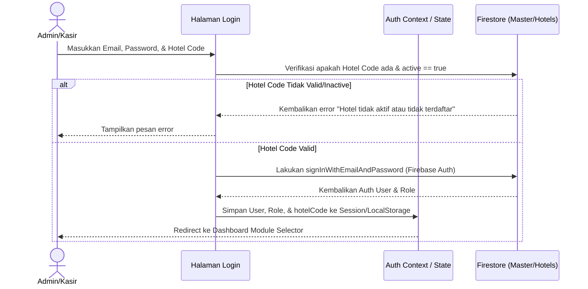
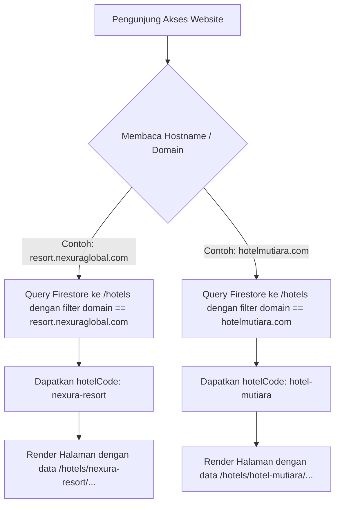

# Dokumentasi Pengembangan & Rencana Multi-Hotel CRS (Nexura Global Hospitality)

Dokumen ini mencatat status terakhir pengerjaan sistem dan memetakan rencana detail pengembangan sistem menjadi **Multi-Hotel Central Reservation System (CRS)** dengan satu basis kode logika, namun basis data yang terisolasi per hotel.

---

## 1. Status Terakhir Pengerjaan (Completed)

Berikut adalah perbaikan dan optimasi yang telah diterapkan dan dipush ke branch `main`:

*   **Pencegahan Loop Firestore**: Audit pada dashboard `admin-dashboard` dan `Point-of-sales-Nextjs-main` memastikan semua listener `onSnapshot` dilepas (unsubscribed) saat komponen unmount untuk menghindari penggunaan memori berlebih dan ledakan tagihan Firestore.
*   **Cascade Deletion POS**: Penghapusan booking di Overview Dashboard sekarang secara otomatis mencari dan menghapus dokumen transaksi POS yang terkait di koleksi `pos_orders` dan `revenue_transactions`.
*   **Perbaikan Hapus Transaksi POS (Tanpa Batas 10 Hari)**: Handler `DELETE` pada API transaksi POS (`/api/transactions/[id]`) tidak lagi membatasi pencarian `daily_revenue` pada 10 hari terakhir saja. Sistem kini mendeteksi tanggal transaksi asli secara dinamis, mengonversinya ke Waktu Jakarta (`Asia/Jakarta`), lalu langsung mengupdate dokumen `daily_revenue` spesifik (`hotelId_YYYY-MM-DD`).
*   **Pagination & Lazy Loading**: Menambahkan sistem pagination berbasis cursor (`limit` + `startAfter`) pada koleksi besar seperti `roomTypes` dan `gallery` untuk menekan biaya Firestore Read.
*   **Sistem Soft-Delete**: Data transaksi yang dihapus sekarang ditandai dengan flag `isDeleted: true` dan timestamp `deletedAt`. Cloud Function terjadwal secara otomatis membersihkan data yang berumur lebih dari 30 hari secara permanen di latar belakang.
*   **Port Dynamic Redirect**: Redireksi dari dashboard admin ke POS tidak lagi hardcoded ke port `3000`. Dashboard mengirimkan `dashboardUrl` saat mengarahkan user, lalu POS menyimpannya ke `localStorage` agar user dapat diarahkan kembali ke dashboard admin asal secara dinamis di port mana pun aplikasi tersebut berjalan.

---

## 2. Arsitektur Multi-Hotel CRS (Roadmap)

### A. Strategi Isolasi Database Firestore
Untuk mendukung banyak hotel dengan satu logika sistem, kita akan menerapkan **Single Project - Dynamic Path Isolation**. 

Struktur database master akan memiliki satu koleksi utama bernama `hotels` sebagai registry data config masing-masing hotel. Data operasional hotel akan dipisahkan menggunakan sub-koleksi di bawah dokumen hotel tersebut:

```text
/hotels (Koleksi Master)
  ├── [hotelCode: nexura-resort] (Dokumen Hotel A)
  │     ├── name: "Nexura Resort"
  │     ├── active: true
  │     ├── domain: "resort.nexuraglobal.com"
  │     ├── billingStatus: "paid"
  │     └── ... metadata hotel
  │     /* Sub-koleksi Data Operasional Hotel A */
  │     ├── roomTypes (Koleksi)
  │     ├── packages (Koleksi)
  │     ├── pos_orders (Koleksi)
  │     ├── daily_revenue (Koleksi)
  │     └── revenue_transactions (Koleksi)
  │
  ├── [hotelCode: hotel-mutiara] (Dokumen Hotel B)
  │     ├── name: "Hotel Mutiara"
  │     ├── active: false (Sistem ter-suspend)
  │     ├── domain: "hotelmutiara.com"
  │     └── ...
  │     /* Sub-koleksi Data Operasional Hotel B */
  │     ├── roomTypes (Koleksi)
  │     └── ...
```

**Keunggulan**: 
* Keamanan data terjamin menggunakan Firebase Security Rules berbasis parameter `hotelCode`.
* Tidak ada percampuran data transaksi antar hotel.

---

### B. Flow Autentikasi & Login Baru
Untuk masuk ke sistem CRS, alur login akan diubah sebagai berikut:



**Detail Teknis**:
* Field `hotelCode` wajib diisi saat login.
* Di `AuthContext.tsx`, `hotelCode` akan diekspos secara global. Semua hooks Firestore (seperti `useRoomTypes`, `useOverview`, dll) akan membaca `hotelCode` dari context ini untuk membuat referensi database:
  ```typescript
  // Contoh perubahan referensi query di hooks
  const path = `hotels/${hotelCode}/roomTypes`;
  const q = query(collection(db, path), orderBy("name"));
  ```

---

### C. Menu Superadmin (CRS Central Portal)
Superadmin memerlukan satu dashboard sentral untuk mengontrol semua tenant/hotel. Halaman ini diproteksi hanya untuk user dengan role `superadmin`.

#### Fitur Utama Superadmin:
1.  **Registrasi Hotel Baru**:
    *   Input: Kode Hotel (unik, huruf kecil tanpa spasi, misal: `grand-royal`), Nama Hotel, Alamat, Domain Resmi.
    *   Proses: Membuat dokumen baru di `/hotels/{hotelCode}` dengan parameter default sistem.
2.  **Tombol Aktivasi (On/Off Switch)**:
    *   Sebuah toggle switch untuk mengubah field `active` (`true` / `false`) pada dokumen master hotel.
    *   Jika status `active` diubah menjadi `false`, maka seluruh user dari `hotelCode` tersebut yang mencoba mengakses dashboard atau POS akan langsung dihadang dengan halaman **"System Suspended / Hubungi Administrator"**.
3.  **Billing & Invoice Logger**:
    *   Mencatat siklus pembayaran per hotel. Jika masa aktif langganan habis, sistem otomatis mengubah parameter `active` menjadi `false`.

---

### D. Flow Landing Page Otomatis (Dynamic Domain Binding)
Untuk landing page (port `3002` atau hosting web publik), hotel tidak perlu mendeploy ulang source code frontend baru. Aplikasi landing page akan membaca data secara dinamis berdasarkan URL yang diakses oleh tamu/pengunjung.



**Detail Teknis**:
* Aplikasi Landing Page menggunakan middleware Next.js atau membaca `window.location.hostname` pada browser klien.
* Lakukan pencarian satu kali (caching di session) untuk memetakan domain ke `hotelCode`.
* Semua aset gambar, harga kamar, dan paket stay yang ditampilkan akan otomatis merujuk ke sub-koleksi milik `hotelCode` terkait.

---

### E. Langkah-Langkah Migrasi Data & Kode
Apabila sistem ini siap diintegrasikan, berikut adalah tahapan pengerjaan yang direkomendasikan:

1.  **Langkah 1**: Buat koleksi master `hotels` di Firestore dan daftarkan `nexura-resort` sebagai hotel pertama.
2.  **Langkah 2**: Pindahkan data koleksi root saat ini (`roomTypes`, `packages`, `pos_orders`, `daily_revenue`, `revenue_transactions`) ke dalam sub-koleksi `/hotels/nexura-resort/...`.
3.  **Langkah 3**: Modifikasi `AuthContext.tsx` untuk menangani state login dengan field `hotelCode`.
4.  **Langkah 4**: Refactor semua hooks pemanggilan data di dashboard dan POS agar menyisipkan parameter `hotelCode` pada path koleksi Firestore.
5.  **Langkah 5**: Tambahkan halaman `/superadmin` di dashboard utama yang dikunci hanya untuk role superadmin.
6.  **Langkah 6**: Sesuaikan landing page agar dapat mendeteksi domain tamu secara dinamis.

---

### F. Struktur Dokumen Master `/hotels` secara Detail
Untuk memastikan database teratur, setiap dokumen di `/hotels/{hotelCode}` wajib memiliki skema standar berikut:

```typescript
interface HotelMasterDoc {
  hotelCode: string;       // ID unik dokumen (lowercase, kebab-case, misal: nexura-resort)
  name: string;            // Nama resmi Hotel (misal: Nexura Resort & Spa)
  active: boolean;         // Flag status sistem aktif/nonaktif
  domain: string;          // Domain utama custom (misal: resort.nexuraglobal.com)
  subdomain: string;       // Subdomain cadangan (misal: nexura-resort.nexuracrs.com)
  createdAt: string;       // ISO string waktu registrasi
  suspendedAt: string | null; // ISO string jika sistem dinonaktifkan
  
  // Kontak & Alamat
  address: string;
  phone: string;
  email: string;
  
  // Konfigurasi Layanan & Billing
  billing: {
    plan: "basic" | "premium" | "enterprise";
    cycle: "monthly" | "yearly";
    nextDueDate: string;   // Tanggal jatuh tempo tagihan berikutnya
    status: "paid" | "overdue" | "grace-period";
  };
}
```

---

### G. Aturan Keamanan (Firebase Security Rules) Multi-Tenant
Untuk mencegah kebocoran data (misalnya User Hotel A tidak sengaja membaca data Hotel B), Firebase Security Rules harus dikonfigurasi untuk mengecek `hotelCode` pada klaim token user (`auth.token.hotelCode`):

```javascript
rules_version = '2';
service cloud.firestore {
  match /databases/{database}/documents {
    
    // Fungsi pembantu untuk memverifikasi kepemilikan hotelCode
    function isAssignedToHotel(hotelCode) {
      return request.auth != null && request.auth.token.hotelCode == hotelCode;
    }
    
    // Fungsi pembantu untuk Superadmin
    function isSuperadmin() {
      return request.auth != null && request.auth.token.role == 'superadmin';
    }

    // Aturan untuk Koleksi Master Hotels
    match /hotels/{hotelCode} {
      allow read: if request.auth != null; // Semua user terdaftar bisa membaca config
      allow write: if isSuperadmin();      // Hanya superadmin yang bisa merubah/mendaftar hotel baru
      
      // Aturan untuk Sub-koleksi operasional di bawah hotelCode tertentu
      match /{document=**} {
        allow read, write: if isSuperadmin() || isAssignedToHotel(hotelCode);
      }
    }
  }
}
```
*Catatan*: Klaim `auth.token.hotelCode` akan disematkan secara aman menggunakan Firebase Custom Claims pada level Cloud Functions setelah proses sign-in diverifikasi.

---

### H. Alur Penanganan Status Inactive (System Suspended)
Jika superadmin mematikan akses sebuah hotel (`active = false`) atau sistem mendeteksi billing overdue, penanganan otomatis di aplikasi klien (Dashboard & POS) diatur dengan flow berikut:

1. **Pendeteksian Awal (Auth Context)**:
   Saat aplikasi memuat halaman atau mendeteksi perubahan state authentikasi, sistem melakukan pengecekan data status ke `/hotels/{hotelCode}` secara real-time atau pada saat inisialisasi session.
2. **Pencegahan Akses (Guard Component)**:
   Kita membuat pembungkus rute global (`HotelStatusGuard.tsx`) yang memeriksa properti `active`.
3. **Redirect Halaman Peringatan**:
   Jika `active == false`, user akan langsung dialihkan ke halaman `/suspended` dengan pesan informatif:
   > **"Sistem Ditangguhkan"**  
   > Layanan untuk hotel Anda sedang dinonaktifkan sementara oleh administrator sistem. Silakan hubungi bagian administrasi atau pusat dukungan Nexura Global Hospitality untuk informasi lebih lanjut.
4. **Pemblokiran API**:
   Firebase Security Rules secara otomatis menolak seluruh request read/write yang dikirimkan oleh klien, menjaga integritas data tetap aman selama masa penangguhan pembayaran.

